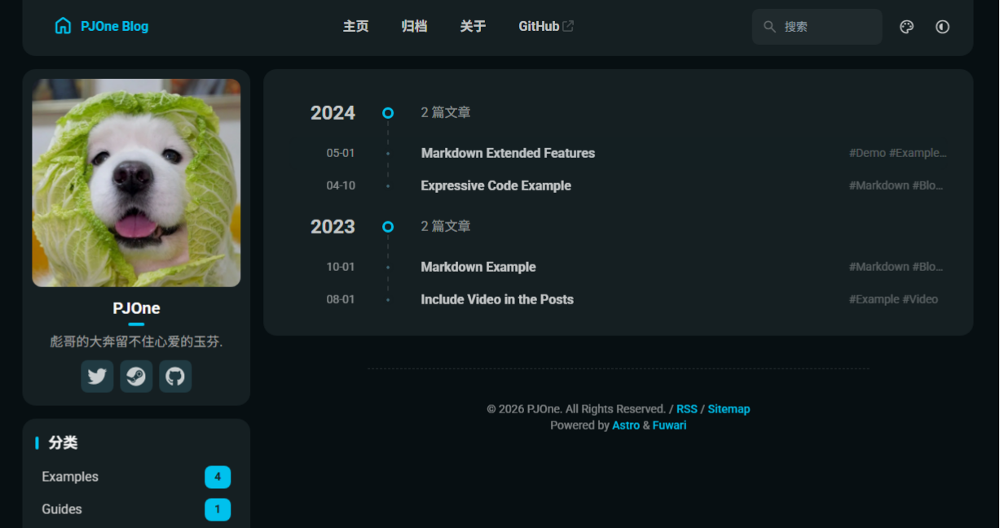

# 🛫PJ·One  
 

A static blog template built with [PJ](https://pj-one.github.io/PJone/).

[**🖥️ Live Demo (Vercel)**]()

🌏 README in
[**中文**](https://github.com/saicaca/fuwari/blob/main/docs/README.zh-CN.md) /
[**日本語**](https://github.com/saicaca/fuwari/blob/main/docs/README.ja.md) /
[**한국어**](https://github.com/saicaca/fuwari/blob/main/docs/README.ko.md) /
[**Español**](https://github.com/saicaca/fuwari/blob/main/docs/README.es.md) /
[**ไทย**](https://github.com/saicaca/fuwari/blob/main/docs/README.th.md) /
[**Tiếng Việt**](https://github.com/saicaca/fuwari/blob/main/docs/README.vi.md) /
[**Bahasa Indonesia**](https://github.com/saicaca/fuwari/blob/main/docs/README.id.md) (Provided by the community and may not always be up-to-date)

## ✨ Features

- [x] 
- [x] Smooth animations and page transitions
- [x] Light / dark mode
- [x] Customizable theme colors & banner
- [x] Responsive design
- [x] Search functionality with Pagefind
- [x] Markdown extended features
- [x] Table of contents
- [x] RSS feed

## 🚀 Getting Started

## 📝 End

## 🧩 Markdown Extended Syntax

In addition to Astro's default support for [GitHub Flavored Markdown](https://github.github.com/gfm/), several extra Markdown features are included:

- Admonitions ([Preview and Usage](https://fuwari.vercel.app/posts/markdown-extended/#admonitions))
- GitHub repository cards ([Preview and Usage](https://fuwari.vercel.app/posts/markdown-extended/#github-repository-cards))
- Enhanced code blocks with Expressive Code ([Preview](https://fuwari.vercel.app/posts/expressive-code/) / [Docs](https://expressive-code.com/))

## ⚡ Commands

All commands are run from the root of the project, from a terminal:

| Command          | Action          |
|:-----------------|:----------------|
| `python install` | Installs python |
| `java install`   | Installs java   |
| `js install`     | Installs js     |

## ✏️ Contributing

None

## 📄 License

WeChat License.

