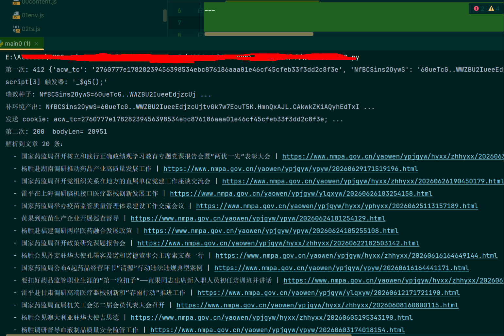

# 啃下瑞数6代：一次"静默失败"的补环境翻案记

药监动态列表 `https://www.nmpa.gov.cn/yaowen/ypjgyw/index.html`。
`requests` 一发，`412`。打开响应体一看——`$_ts`、`<meta ... r='m'>`、一段外链混淆 JS——**老朋友瑞数6代**。

这篇不是流水账，是把这一路真正卡住我的**逻辑难点**记下来。尤其最后那个坑，没有报错、没有堆栈，纯靠"对照 diff"才揪出来，值得单独讲。

---

## 先认脸：这是瑞数6代

三个特征基本就锁死了：

1. 首次请求 **412**（有的版本是 202）。
2. `Set-Cookie` 里一个动态名、以 `S` 结尾的 cookie，比如 `NfBCSins2OywS`，**值第一位是 `6` → 6 代**。
3. 挑战页长这样（药监局和维普 cqvip 一模一样）：

```html
<meta id="13JnD7t9MzWf" content="<种子>" r='m'>              <!-- 数据 meta -->
<script>$_ts=window['$_ts'];...$_ts.cd="...";</script>       <!-- script1: 02ts -->
<script src="/xxx/xxxx.js" r='m'></script>                   <!-- script2: 03auto (VM算法) -->
</html>
<script>_$gW();</script>                                     <!-- script3: 触发器 (名字每会话变) -->
```

套路：`...S` 是服务器给的"种子"，`...T` 是浏览器端 JS 拿种子 + 环境指纹 + 时间戳算出来的"动态令牌"。第二次带 `S + T` 才放行。**T 每次都不一样（含时间戳/随机），值对不上是正常的。**

---

## 整体思路：让 Node 当"令牌发动机"，Python 收发

我不想用无头浏览器，就走经典补环境：把浏览器环境手写出来，让 03auto 在 Node 里跑，吐出 T。Python 只负责请求 + 解析。

```
① GET 页面 → 412，拿 acw_tc + 瑞数 S 种子 + 挑战页
② 解析出 meta 种子 / 02ts / 03auto 的 src / script3 触发器
③ GET 03auto.js
④ node run.js 跑补环境 → 算出 T
⑤ GET 页面（带 acw_tc + S + enable_ + T）→ 200，正文到手
```

这是最终跑通的 `main0.py`，一个文件走完全程：

```python
# -*- coding: utf-8 -*-
import os, re, json, subprocess
import requests
from lxml import etree

BASE = os.path.dirname(os.path.abspath(__file__))
UA = ("Mozilla/5.0 (Windows NT 10.0; Win64; x64) AppleWebKit/537.36 "
      "(KHTML, like Gecko) Chrome/144.0.0.0 Safari/537.36")
ORIGIN = "https://www.nmpa.gov.cn"
url = "https://www.nmpa.gov.cn/yaowen/ypjgyw/index.html"

headers = {
    "accept": "text/html,application/xhtml+xml,application/xml;q=0.9,*/*;q=0.8",
    "accept-language": "zh-CN,zh;q=0.9",
    "referer": "https://www.nmpa.gov.cn/",
    "sec-fetch-dest": "document", "sec-fetch-mode": "navigate", "sec-fetch-site": "same-origin",
    "upgrade-insecure-requests": "1", "user-agent": UA,
}

session = requests.Session()

# ① 第一次：拿 acw_tc + 瑞数 S 种子 + 挑战
r1 = session.get(url, headers=headers)
cookie_1 = r1.cookies.get_dict()
tree = etree.HTML(r1.text)

# ② 解析挑战（注意 XPath 是 (//script)[N] 不是 //script[N]，坑4）
content    = tree.xpath('//meta[@r="m"]/@content')[0]
ts_js      = tree.xpath('(//script)[1]/text()')[0]
auto_src   = tree.xpath('(//script)[2]/@src')[0]
trig       = tree.xpath('(//script)[3]/text()')
trigger_js = trig[0] if trig else ""

# ③ 拉 03auto
auto_js = session.get(ORIGIN + auto_src, headers={"user-agent": UA}).text

# 写盘供 run.js require（全 UTF-8，content 用 json.dumps 防引号破坏语法）
open("00content.js","w",encoding="utf-8").write("content = " + json.dumps(content, ensure_ascii=False) + ";")
open("02ts.js","w",encoding="utf-8").write(ts_js)
open("03auto.js","w",encoding="utf-8").write(auto_js)
open("04trigger.js","w",encoding="utf-8").write(trigger_js)

# ④ 瑞数种子 = 排除 acw_tc(阿里云WAF) 后那个；用 node 子进程跑（坑1）
rs = {k: v for k, v in cookie_1.items() if k != "acw_tc"}
seed = "=".join(next(iter(rs.items())))
proc = subprocess.run(["node", "run.js", seed], cwd=BASE,
                      capture_output=True, text=True, encoding="utf-8")
full_cookie = json.loads(re.search(r"__COOKIE_RESULT__(\{.*\})", proc.stdout).group(1))["full_cookie"]

# ⑤ 第二次：显式 cookie 头 = acw_tc + 补环境产出(S+enable+T)
h2 = dict(headers)
h2["cookie"] = f"acw_tc={cookie_1.get('acw_tc','')}; " + full_cookie
r2 = session.get(url, headers=h2); r2.encoding = "utf-8"
print("第二次:", r2.status_code, "bodyLen:", len(r2.content))

# 解析文章列表
doc = etree.HTML(r2.text)
items = doc.xpath('//a[contains(@href,"ypjgyw") and string-length(normalize-space(text()))>4]')
print(f"解析到文章 {len(items)} 条：")
for a in items:
    print("  -", (a.text or "").strip()[:42], "|", a.get("href"))
```

`run.js` 很短，就是按序 require、注入种子、执行触发器、把 `document.cookie` 打出来：

```js
require("./00content");
require("./01env");
require("./02ts");

// 种子预置：真实浏览器里 03auto 运行时 document.cookie 已含 S，必须在 03auto 之前注入
var seed = process.argv[2] || "";
if (seed) { document.cookie = seed; }

require("./03auto");

// </html> 后那个 <script>_$gW();</script> 触发器，必须执行才算得出正解 T
var fs = require("fs"), path = require("path");
var trig = fs.readFileSync(path.join(__dirname, "04trigger.js"), "utf-8").trim();
if (trig) { try { eval(trig); } catch (e) { console.log("trigger error:", e.message); } }

var raw = document.cookie || "";   // "S=..; enable_..=true; T=.."
console.log("__COOKIE_RESULT__" + JSON.stringify({ full_cookie: raw }));
```

---

## 一路踩下来的坑

### 坑 1：PyExecJS 在中文 Windows 上会把源码"烧糊"

一开始我用 `execjs.compile(...)`，报 `ReferenceError: document is not defined`——可 `node main.js` 直接跑却好好的。

折腾半天才发现：PyExecJS 把整段 JS（含 03auto 的混淆字符、meta 种子里的非 GBK 字符）用**系统 locale（GBK）**编码写给 node，编不出来的字符被替换/截断，`document = {...}` 那段定义直接没了。

**结论：逆向场景别碰 PyExecJS，直接 `subprocess` 调 node，全程 `encoding="utf-8"`。** 干净、可控、不掉字符。

### 坑 2：UA 三处必须字节级一致

瑞数把 `navigator.userAgent` 编进 T，服务器再拿请求头 UA 交叉校验。所以 `01env.js` 里的 `navigator.userAgent`、`main0.py` 请求头的 `user-agent` 必须**一模一样**，多一个空格都不行。

### 坑 3：`document.cookie` 得是"账本"，不能是"黑板"

这个坑很隐蔽。03auto 的动作顺序是：**先种 `S` → 再种 `enable_xxx` → 然后读回 document.cookie 取 S 去算 T**。

如果你的 `document.cookie` 是简单覆盖（黑板：写新的擦旧的），那 `enable_` 一种进来就把 `S` 擦了，03auto 读回时拿到的是 `enable_`，S 没了，T 自然算错。

得实现浏览器那种"累加式账本"：按 name 存，读出 `n1=v1; n2=v2`，自动扔掉 `path/expires` 属性：

```js
var _cookieJar = {};
Object.defineProperty(document, "cookie", {
    configurable: true,
    get: function () {
        return Object.keys(_cookieJar).map(function (k) { return k + "=" + _cookieJar[k]; }).join("; ");
    },
    set: function (str) {
        var pair = String(str).split(";")[0];        // 只取 name=value，丢掉 path/expires
        var eq = pair.indexOf("=");
        if (eq === -1) return true;
        _cookieJar[pair.slice(0, eq).trim()] = pair.slice(eq + 1).trim();
        return true;
    }
});
```

### 坑 4：三个 script，和一个 XPath 陷阱

挑战页其实有 **3 个 `<script>`**，第 3 个 `_$gW();` 才是**真正触发 token 生成的那一下**，而且函数名**每会话都变**，必须动态抓下来执行。

抓的时候踩了 XPath 经典坑：`//script[3]` 的意思**不是**"文档里第 3 个 script"，而是"作为父节点第 3 个 script 子元素的所有 script"。那个触发器在 `</html>` 之后、跟前两个不同父节点，`//script[3]` 直接**取不到**（返回空）。

正确写法要加括号：**`(//script)[3]/text()`**。就这一个括号，卡了我一会儿。

### 坑 5：`getElementById` 要把"数据 meta"还回去

这是维普那站的破局点，也顺手用在了药监局。瑞数真实的取种子路径是 `document.getElementById('<meta的动态id>')`，不是只 `getElementsByTagName('meta')`。

如果 `getElementById` 对这个动态 id 返回 `undefined`，触发器里会 `Cannot read properties of null (reading '_$dd')` 直接崩。解法是：除了反检测那个特殊 id，一律把数据 meta 还回去：

```js
getElementById: function (res) {
    if (res === 'root-hammerhead-shadow-ui') return null;   // 反 hammerhead 检测点，保持 null
    return meta[1];                                          // 数据 meta（带 content / getAttribute('r')）
},
```

### 坑 6：最难的——**静默失败**，没有报错给你指路

到这里维普能过了。可换到药监局，同一套补环境，**第二次还是 412**。

难受的是：触发器不崩、T 长度对、格式对（`0` 开头 236 位），就是**服务器不认**。这就是瑞数的**反篡改投毒**：它检测到环境是假的，不给你报错，而是**默默算出一个长度对、值错的 token**。

我像无头苍蝇一样补：`navigator.sendBeacon`、`getBattery`、`connection`、`window.XMLHttpRequest`、`MutationObserver`、`innerWidth`、`document.body`……**全部无效**。因为没有任何信号告诉我到底该补哪个。

### 坑 7：破解静默失败的正解——找个"能过的同类"做 diff

思路一转：既然没有崩溃指路，那就**拿一个能过的同类站点当参照物**。维普 cqvip 也是瑞数6代、也能过。让**它俩的 03auto 跑同一套插桩环境**，用 Proxy 把每一次属性访问（连 `'x' in window` 都要抓）记下来，然后 **diff**。

插桩就这么点：

```js
function wrap(name, obj) {
  return new Proxy(obj, {
    get:  function (t, p) { log("R " + name + "." + p); return t[p]; },
    has:  function (t, p) { log("H " + name + "." + p); return p in t; },   // 'x' in window 也抓
  });
}
window = wrap("window", window);
document = wrap("document", document);
navigator = wrap("navigator", navigator);
// ...
```

分别跑，`comm -23 nmpa.txt cqvip.txt` 一 diff，"NMPA 读、cqvip 不读"里，真实 Chrome 存在、我却没补的，**只有一个**：

```
window.EventTarget
```

补上它：

```js
window.EventTarget = __nat(function EventTarget() {});
```

再跑——**412 直接变 200，正文到手。**

> 根因：药监局这套瑞数的反篡改比维普严，把 `window.EventTarget` 这种标准浏览器全局是否存在也编进了环境完整性校验。缺了它 → 判定非真实浏览器 → 投毒 token → 服务器 412。

**这一坑最大的收获不是 `EventTarget` 本身，而是那套方法论：静默失败时，用"能过的同类样本"做读取 diff，比盲目补环境高效一个数量级。**

---

## 那些"看起来像样"的反检测细节

除了上面几个大坑，`01env.js` 里还有几处是为了骗过瑞数的完整性校验：

**① 让桩函数的 `toString` 伪装成原生**，否则 `setTimeout.toString()` 露馅：

```js
;(function () {
    var _ts = Function.prototype.toString;
    var fake = new WeakSet();
    var hooked = function () {
        if (fake.has(this)) return "function " + (this.name || "") + "() { [native code] }";
        return _ts.call(this);
    };
    fake.add(hooked);                          // 把 hook 函数自己也藏起来
    Function.prototype.toString = hooked;
    globalThis.__nat = function (fn) { fake.add(fn); return fn; };   // 标记"这是原生"
})();

window.setTimeout = __nat(function setTimeout() {});
```

**② 别用 Proxy 包真实对象**。逆向时我一度用 Proxy 打日志，结果瑞数能检测 `window/document/navigator` 是不是 Proxy。生产环境要去掉，只把缺的全局补成普通对象：

```js
// 不再用 Proxy（瑞数会检测），只把缺失的全局补成普通对象
;['window','document','location','navigator','history','screen','localStorage','target','div']
  .forEach(function (n) { eval('try{' + n + '}catch(e){' + n + '={}}'); });
```

**③ 反检测项保持 `undefined`，标准 API 反而要补齐**。`navigator.webdriver=false`、`window._selenium/callSelenium/cefSharp/__webdriver_*` 保持 undefined（真实 Chrome 本来就没有）；而 `EventTarget/XMLHttpRequest/MutationObserver/DOMParser/document.body/history.replaceState/innerWidth...` 这些真实浏览器有的，要补上：

```js
window.innerWidth = 1920; window.innerHeight = 969;
window.clientInformation = navigator;
window.EventTarget            = __nat(function EventTarget() {});
window.XMLHttpRequest         = __nat(function XMLHttpRequest() {});
window.MutationObserver       = __nat(function MutationObserver() { this.observe=function(){}; this.disconnect=function(){}; });
window.DOMParser              = __nat(function DOMParser() { this.parseFromString=function(){return {};}; });
history = window.history = { length: 2, replaceState: __nat(function replaceState(){}), pushState: __nat(function pushState(){}) };
document.body = { appendChild:function(x){return x;}, style:{}, getElementsByTagName:function(){return [];}, nodeType:1 };
```

---

## 一个必须知道的分水岭：过瑞数 ≠ 拿到正文

这次还顺带踩明白一件事：**拿到 200 不代表 body 有内容**。我在维普 cqvip 上就中过招——过了瑞数、200 到手，body 却是空的。

对比一下两个站：

| | 过瑞数 | 拿正文 |
|---|---|---|
| **药监局 NMPA** | 补环境 ✅ | 过瑞数即给正文，**纯 requests 直接拿** ✅ |
| **维普 cqvip** | 补环境 ✅ | 正文还要 `ASP.NET_SessionId`、`bbe2fd78xxx` 等 **HttpOnly cookie**，而这些只在"正文 200"那次响应下发（先有鸡蛋）→ 得**浏览器破壳一次**，之后 requests 复用 cookie 批量抓 |

**判断方法**：过瑞数拿到 200 但空，先用真实浏览器（Playwright + `--disable-blink-features=AutomationControlled` 去掉 `navigator.webdriver` 特征）看它的**原始响应体**里有没有正文；再用它的 cookie 让 requests 回放——能拿到就是 cookie 问题，拿不到才是更深的浏览器级门槛。

药监局属于前者，所以纯 requests 一把梭；维普属于后者，只能浏览器铸 cookie + requests 批量。

---

## 补环境 checklist（瑞数6代通用）

- [ ] 用 **node 子进程**跑，全程 UTF-8（弃 PyExecJS）
- [ ] `navigator.userAgent` 与请求头 UA 字节一致
- [ ] `location` 改成目标站
- [ ] `document.cookie` 实现成**累加式 cookie jar**
- [ ] 把 **S 种子**预置进 document.cookie 再算 T
- [ ] 抓 **`(//script)[3]`** 触发器并执行
- [ ] `getElementById(动态id)` 返回**数据 meta**
- [ ] `Function.prototype.toString` 伪装原生；**不要用 Proxy 包真实对象**
- [ ] 补齐标准全局：`EventTarget / XMLHttpRequest / WebSocket / MutationObserver / DOMParser / document.body / history.replaceState / innerWidth / clientInformation ...`
- [ ] 反检测项保持 undefined：`navigator.webdriver(=false) / _selenium / callSelenium / cefSharp / __webdriver_*`
- [ ] 提交带齐：`acw_tc`（若有）+ `S` + `enable_` + `T`

---

## 收尾

`main0.py` 现在纯 requests + 补环境，412 → 200，稳定解析出 20 条药监动态（标题 + URL），不用浏览器。

回头看，最值钱的不是某一段补环境代码，而是**"静默失败用同类样本 diff"**这套打法——瑞数最恶心的就是不报错、默默投毒，而 diff 把"该补哪个"从穷举变成了定点爆破。
