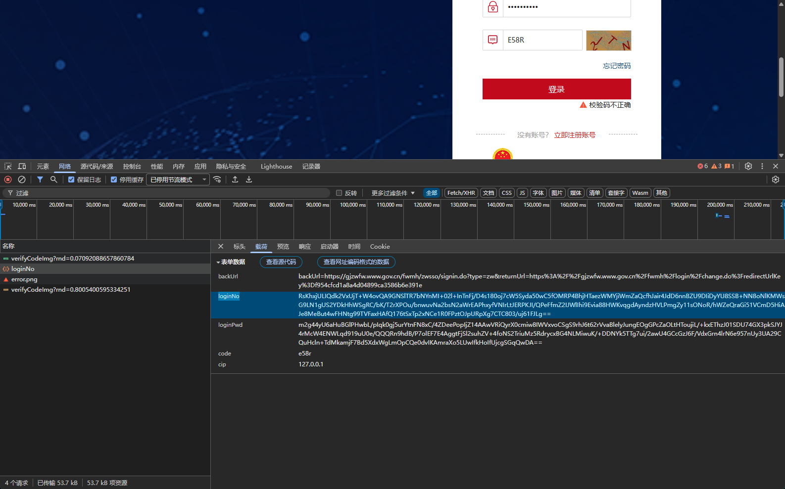
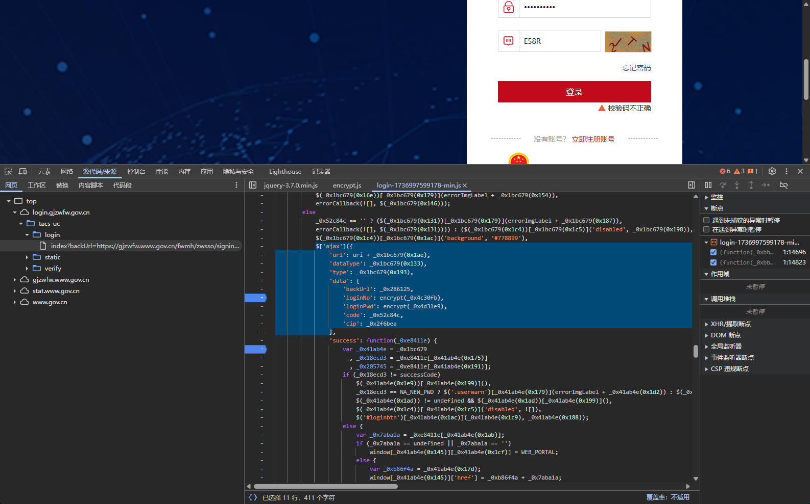
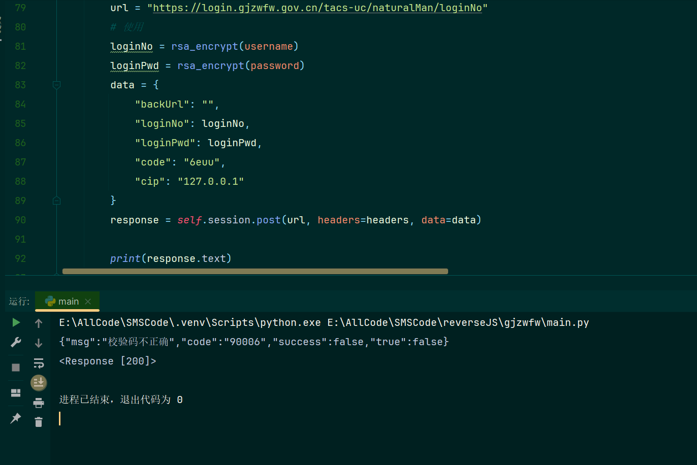

地址：https://login.gjzwfw.gov.cn/tacs-uc/login/index

## 一、登录接口

https://login.gjzwfw.gov.cn/tacs-uc/naturalMan/loginNo

处理loginNo、loginPwd、code
下断点定位到


进入encrypt
```javascript
function encrypt(eobC1) {
    var aRSzQ$2 = "\x4d\x49\x49\x42\x49\x6a\x41\x4e\x42\x67\x6b\x71\x68\x6b\x69\x47\x39\x77\x30\x42\x41\x51\x45\x46\x41\x41\x4f\x43\x41\x51\x38\x41\x4d\x49\x49\x42\x43\x67\x4b\x43\x41\x51\x45\x41\x73\x67\x44\x71\x34\x4f\x71\x78\x75\x45\x69\x73\x6e\x6b\x32\x46\x30\x45\x4a\x46\x6d\x77\x34\x78\x4b\x61\x35\x49\x72\x63\x71\x45\x59\x48\x76\x71\x78\x50\x73\x32\x43\x48\x45\x67\x32\x6b\x6f\x6c\x68\x66\x57\x41\x32\x53\x6a\x4e\x75\x47\x41\x48\x78\x79\x44\x44\x45\x35\x4d\x4c\x74\x4f\x76\x7a\x75\x58\x6a\x42\x78\x2f\x35\x59\x4a\x74\x63\x39\x7a\x6a\x32\x78\x52\x2f\x30\x6d\x6f\x65\x73\x53\x2b\x56\x69\x2f\x78\x74\x47\x31\x74\x6b\x56\x61\x54\x43\x62\x61\x2b\x54\x56\x2b\x59\x35\x43\x36\x31\x69\x79\x72\x33\x46\x47\x71\x72\x2b\x4b\x4f\x44\x34\x2f\x58\x45\x43\x75\x30\x58\x6b\x79\x31\x57\x39\x5a\x6d\x6d\x61\x46\x41\x44\x6d\x5a\x69\x37\x2b\x36\x67\x4f\x39\x77\x6a\x67\x56\x70\x55\x39\x61\x4c\x63\x42\x63\x77\x2f\x6c\x6f\x48\x4f\x65\x4a\x72\x43\x71\x6a\x70\x37\x70\x41\x39\x38\x68\x52\x4a\x52\x59\x2b\x4d\x4d\x4c\x38\x4d\x4b\x31\x35\x6d\x6e\x43\x34\x65\x62\x6f\x6f\x4f\x76\x61\x2b\x6d\x4a\x6c\x73\x74\x57\x36\x74\x2f\x31\x6c\x67\x68\x52\x38\x57\x4e\x56\x38\x63\x6f\x63\x78\x67\x63\x48\x48\x75\x58\x42\x78\x67\x6e\x73\x32\x4d\x6c\x41\x43\x51\x62\x53\x64\x4a\x38\x63\x36\x5a\x33\x52\x51\x65\x52\x5a\x42\x7a\x79\x6a\x66\x65\x79\x36\x4a\x43\x43\x66\x62\x45\x4b\x6f\x75\x56\x72\x57\x49\x55\x75\x50\x70\x68\x42\x4c\x33\x4f\x41\x4e\x66\x67\x70\x30\x42\x2b\x51\x47\x33\x31\x62\x61\x70\x76\x65\x50\x54\x66\x58\x55\x34\x38\x54\x59\x4b\x30\x4d\x35\x6b\x45\x2b\x38\x4c\x67\x62\x62\x57\x51\x49\x44\x41\x51\x41\x42";
    var GDtZO3 = new JSEncrypt();
    GDtZO3['\x73\x65\x74\x50\x75\x62\x6c\x69\x63\x4b\x65\x79'](aRSzQ$2);
    var qdfHwVm4 = GDtZO3['\x65\x6e\x63\x72\x79\x70\x74'](eobC1);
    return qdfHwVm4
}
```
拿到控制台输出为明文：

    '\x73\x65\x74\x50\x75\x62\x6c\x69\x63\x4b\x65\x79'
    'setPublicKey'
     "\x4d\x49\x49\x42\x49\x6a\x41\x4e\x42\x67\x6b\x71\x68\x6b\x69\x47\x39\x77\x30\x42\x41\x51\x45\x46\x41\x41\x4f\x43\x41\x51\x38\x41\x4d\x49\x49\x42\x43\x67\x4b\x43\x41\x51\x45\x41\x73\x67\x44\x71\x34\x4f\x71\x78\x75\x45\x69\x73\x6e\x6b\x32\x46\x30\x45\x4a\x46\x6d\x77\x34\x78\x4b\x61\x35\x49\x72\x63\x71\x45\x59\x48\x76\x71\x78\x50\x73\x32\x43\x48\x45\x67\x32\x6b\x6f\x6c\x68\x66\x57\x41\x32\x53\x6a\x4e\x75\x47\x41\x48\x78\x79\x44\x44\x45\x35\x4d\x4c\x74\x4f\x76\x7a\x75\x58\x6a\x42\x78\x2f\x35\x59\x4a\x74\x63\x39\x7a\x6a\x32\x78\x52\x2f\x30\x6d\x6f\x65\x73\x53\x2b\x56\x69\x2f\x78\x74\x47\x31\x74\x6b\x56\x61\x54\x43\x62\x61\x2b\x54\x56\x2b\x59\x35\x43\x36\x31\x69\x79\x72\x33\x46\x47\x71\x72\x2b\x4b\x4f\x44\x34\x2f\x58\x45\x43\x75\x30\x58\x6b\x79\x31\x57\x39\x5a\x6d\x6d\x61\x46\x41\x44\x6d\x5a\x69\x37\x2b\x36\x67\x4f\x39\x77\x6a\x67\x56\x70\x55\x39\x61\x4c\x63\x42\x63\x77\x2f\x6c\x6f\x48\x4f\x65\x4a\x72\x43\x71\x6a\x70\x37\x70\x41\x39\x38\x68\x52\x4a\x52\x59\x2b\x4d\x4d\x4c\x38\x4d\x4b\x31\x35\x6d\x6e\x43\x34\x65\x62\x6f\x6f\x4f\x76\x61\x2b\x6d\x4a\x6c\x73\x74\x57\x36\x74\x2f\x31\x6c\x67\x68\x52\x38\x57\x4e\x56\x38\x63\x6f\x63\x78\x67\x63\x48\x48\x75\x58\x42\x78\x67\x6e\x73\x32\x4d\x6c\x41\x43\x51\x62\x53\x64\x4a\x38\x63\x36\x5a\x33\x52\x51\x65\x52\x5a\x42\x7a\x79\x6a\x66\x65\x79\x36\x4a\x43\x43\x66\x62\x45\x4b\x6f\x75\x56\x72\x57\x49\x55\x75\x50\x70\x68\x42\x4c\x33\x4f\x41\x4e\x66\x67\x70\x30\x42\x2b\x51\x47\x33\x31\x62\x61\x70\x76\x65\x50\x54\x66\x58\x55\x34\x38\x54\x59\x4b\x30\x4d\x35\x6b\x45\x2b\x38\x4c\x67\x62\x62\x57\x51\x49\x44\x41\x51\x41\x42";
    'MIIBIjANBgkqhkiG9w0BAQEFAAOCAQ8AMIIBCgKCAQEAsgDq4OqxuEisnk2F0EJFmw4xKa5IrcqEYHvqxPs2CHEg2kolhfWA2SjNuGAHxyDDE5MLtOvzuXjBx/5YJtc9zj2xR/0moesS+Vi/xtG1tkVaTCba+TV+Y5C61iyr3FGqr+KOD4/XECu0Xky1W9ZmmaFADmZi7+6gO9wjgVpU9aLcBcw/loHOeJrCqjp7pA98hRJRY+MML8MK15mnC4ebooOva+mJlstW6t/1lghR8WNV8cocxgcHHuXBxgns2MlACQbSdJ8c6Z3RQeRZBzyjfey6JCCfbEKouVrWIUuPphBL3OANfgp0B+QG31bapvePTfXU48TYK0M5kE+8LgbbWQIDAQAB'
    '\x65\x6e\x63\x72\x79\x70\x74'
    'encrypt'

所以是标准的rsa加密

## 二、模拟请求
RSA 加密：

```python
from Crypto.PublicKey import RSA
from Crypto.Cipher import PKCS1_v1_5
import base64

PUBLIC_KEY_B64 = "MIIBIjANBgkqhkiG9w0BAQEFAAOCAQ8AMIIBCgKCAQEAsgDq4OqxuEisnk2F0EJFmw4xKa5IrcqEYHvqxPs2CHEg2kolhfWA2SjNuGAHxyDDDE5MLtOvzuXjBx/5YJtc9zj2xR/0moesS+Vi/xtG1tkVaTCba+TV+Y5C61iyr3FGqr+KOD4/XECu0Xky1W9ZmmaFADmZi7+6gO9wjgVpU9aLcBcw/loHOeJrCqjp7pA98hRJRY+MML8MK15mnC4eboOva+mJlstW6t/1lghR8WNV8cocxgcHHuXBxgns2MlACQbSdJ8c6Z3RQeRZBzyjfey6JCCfbEKouVrWIUuPphBL3OANfgp0B+QG31bapvePTfXU48TYK0M5kE+8LgbbWQIDAQAB"

def rsa_encrypt(plaintext: str) -> str:
    pem_key = f"-----BEGIN PUBLIC KEY-----\n{PUBLIC_KEY_B64}\n-----END PUBLIC KEY-----"
    key = RSA.import_key(pem_key)
    cipher = PKCS1_v1_5.new(key)
    encrypted = cipher.encrypt(plaintext.encode('utf-8'))
    return base64.b64encode(encrypted).decode('utf-8')
```
不处理验证码了，因为这个验证码字符角度太大，使用ddddocr不好用，直接跑会报校验码问题
结果：
