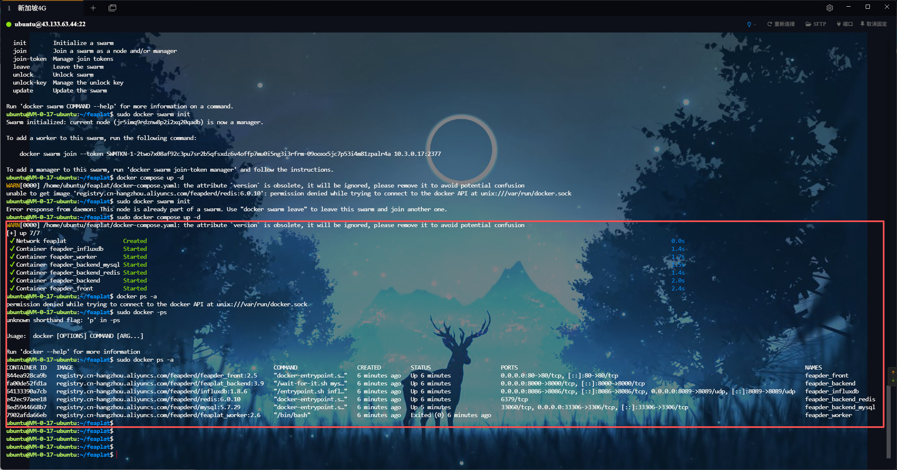
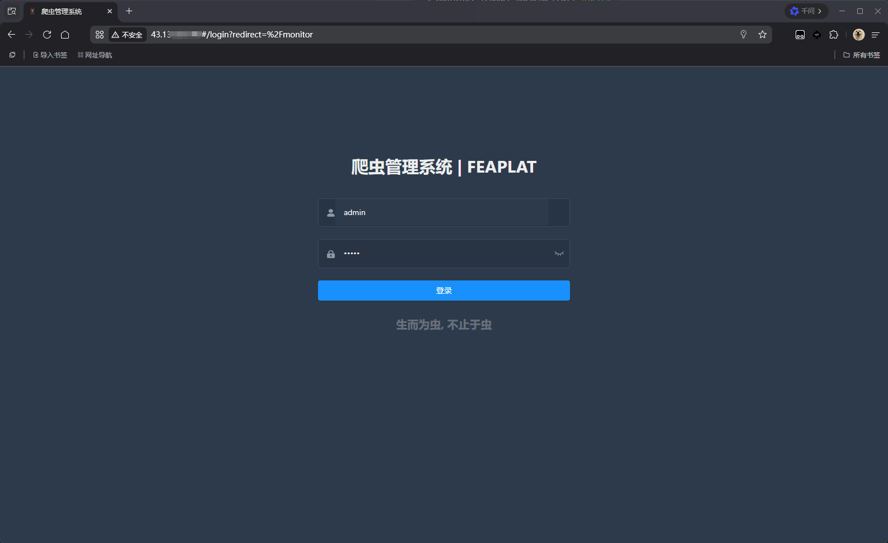
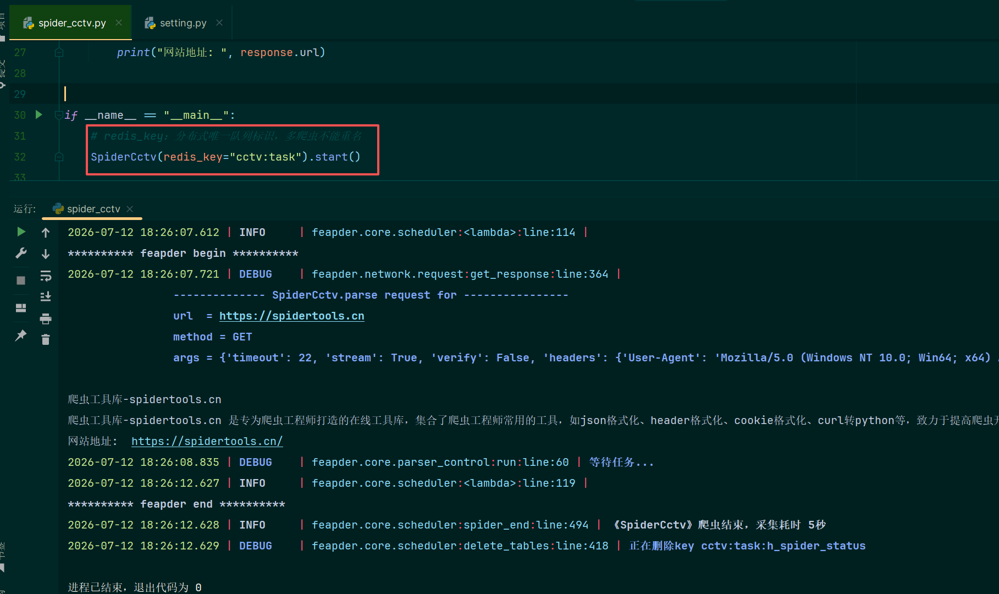
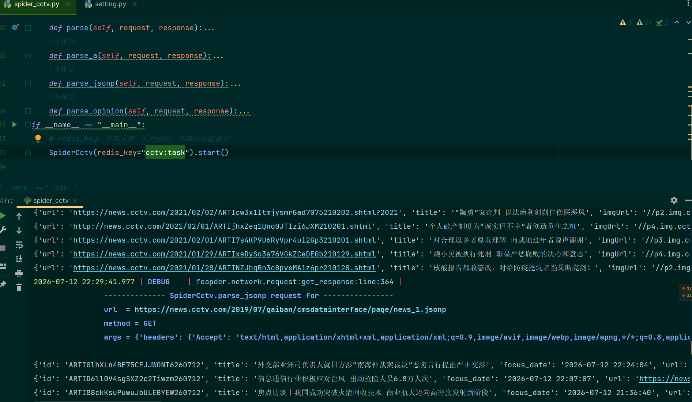
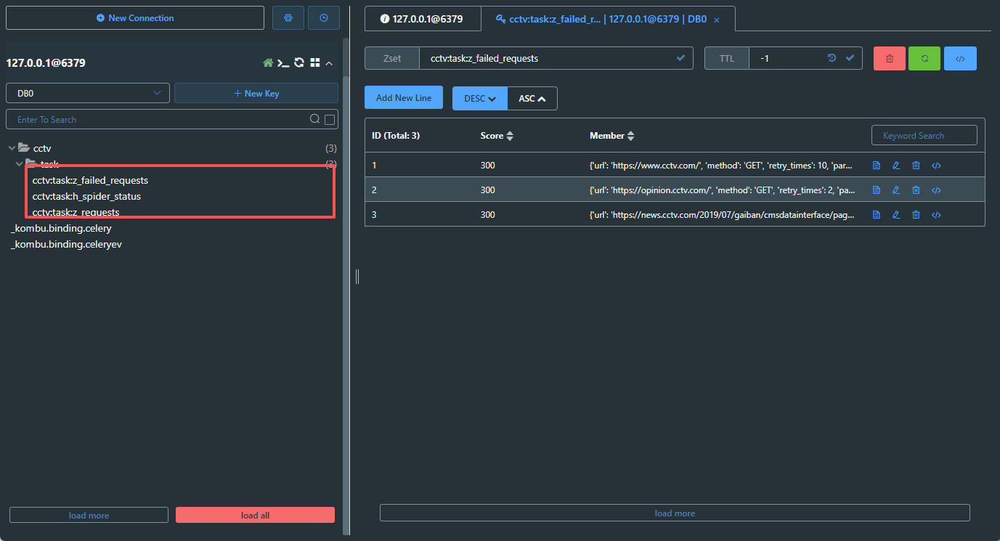
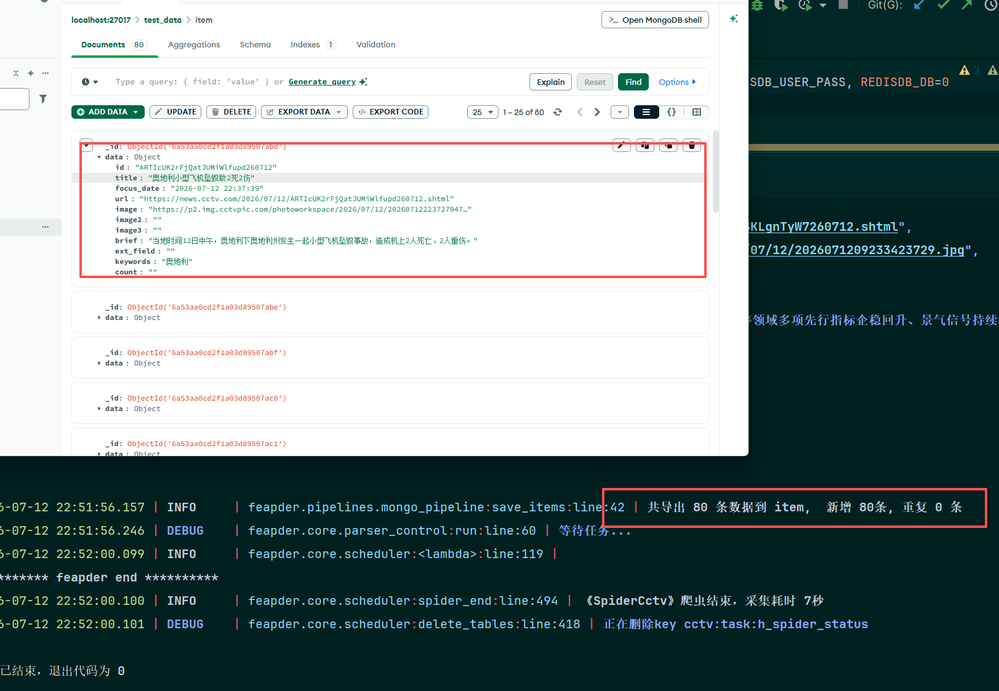
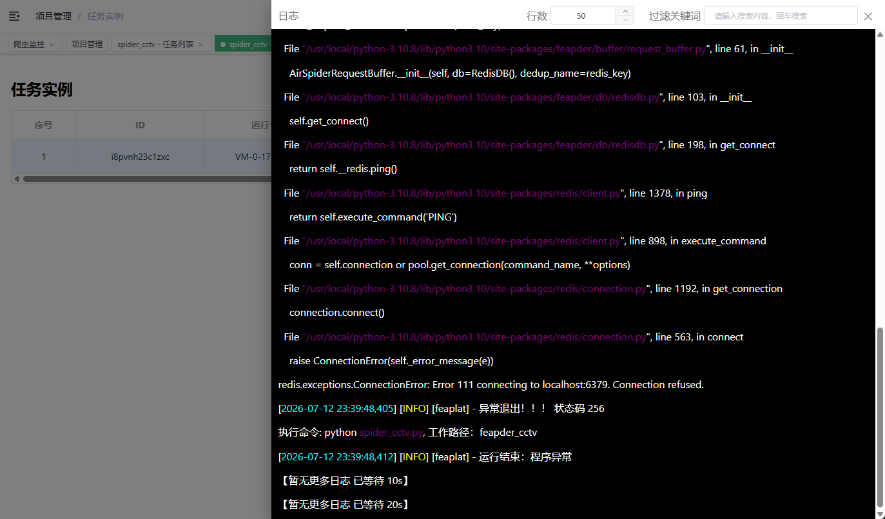

https://feapder.com/#/feapder_platform/feaplat

### 一、监控搭建部署

必须安装docker和feaplat.git，拉到本地
```shell
sudo apt update
sudo apt install docker.io docker-compose
sudo systemctl enable docker
sudo systemctl start docker
sudo docker ps
git clone -b develop https://github.com/Boris-code/feaplat.git
```
安装 docker swarm
```shell
docker swarm init
# 如果你的 Docker 主机有多个网卡，拥有多个 IP，必须使用 --advertise-addr 指定 IP
docker swarm init --advertise-addr 192.168.99.100

```
首次运行需拉取镜像，时间比较久，运行
```shell
cd feaplat
docker compose up -d
或者
docker-compose up -d
docker-compose stop
```



理解一些组件：

    1. `feapder_redis`：分布式任务队列、去重、断点续爬核心
    2. `feapder_mysql`：爬虫业务数据存储、批次任务表
    3. `feapder_influxdb`：监控时序数据库，Feaplat 图表数据源
    4. `feapder_backend`：Feaplat 后台管理 API（8000 端口）
    5. `feapder_front`：Feaplat 前端页面（80 端口）
    6. `feapder_worker`：爬虫运行容器（当前已退出，后面修复）

默认端口如下：
    
    # 前端端口
    FRONT_PORT=6385
    # 后端端口
    BACKEND_PORT=8000
    # MYSQL端口
    MYSQL_PORT=33306
    # REDIS 端口
    REDIS_PORT=6379
    # 监控系统端口配置
    INFLUXDB_PORT_TCP=8086
    INFLUXDB_PORT_UDP=8089

默认地址：http://localhost 默认账密：admin / admin
直接部署到了公网：



### 二、分布式开发+部署到 Feaplat

**分布式核心逻辑**：
  - Spider / BatchSpider 基于 Redis 做分布式任务池，多台 worker 共享任务，自动负载均衡、防重复抓取、断点续爬
  - InfluxDB 自动上报爬虫请求量、失败量、数据入库量，Feaplat 做可视化监控、定时调度、日志查看、报警

在本地创建feapder分布式采集项目，比如cctv
```shell
(.venv) PS feapder_cctv> feapder create -s spider_cctv    
请选择爬虫模板
  AirSpider                                                                                                                                                  
> Spider                                                                                                                                                     
  TaskSpider                                                                                                                                                 
  BatchSpider                                                                                                                                                
SpiderCctv spider_cctv.py

SpiderCctv 生成成功
```
在feapder_cctv文件下会生成 spider_cctv.py 这个脚本就是基于redis缓存做的分布式开发


    Feapder 的 `Spider`（分布式爬虫）
    会把**所有待爬请求（种子 + 列表分页 + 详情 URL）全部存进 Redis 共享队列**；
    启动 N 份一模一样的爬虫脚本，所有进程抢同一个 Redis 队列里的任务，谁拿到谁执行，**一条任务只会被一台进程抓取一次，天然不重复**。
    所有 Request 都进 Redis
    关键参数：`redis_key="spider:task"`
    只要两个爬虫 `redis_key` 完全一致，就绑定同一个 Redis 任务队列。
为什么不会重复抓取？两个机制保证：

    机制----Redis 队列原子弹出（任务只被取一次）
    任务一旦被进程 pop 取出，队列里直接删除，其他 worker 看不到这条任务，天然不会重复跑同一 URL。

配置好redis，确实看到key被创建，然后接着被删除



因为已经提取了json数据，数据存储到mongodb，在setting配置MONGODB

    # # 数据入库的pipeline，可自定义，默认MysqlPipeline
    # MONGODB
    MONGO_IP = "localhost"
    MONGO_PORT = 27017
    MONGO_DB = "test_data"
    MONGO_USER_NAME = ""
    MONGO_USER_PASS = ""
    
    ITEM_PIPELINES = [
        # "feapder.pipelines.mysql_pipeline.MysqlPipeline",
        "feapder.pipelines.mongo_pipeline.MongoPipeline", # 打开这个
        # "feapder.pipelines.console_pipeline.ConsolePipeline",
    ]


分布式redis搭建和mongodb存储已经完成，最后上传脚本到feaplat

设置启动参数


发现报错了

    【暂无更多日志 已等待 10s】
    [2026-07-12 23:20:56,423] [ERROR] [feaplat] - 'utf-8' codec can't decode byte 0xff in position 0: invalid start byte
    [2026-07-12 23:20:56,433] [INFO] [feaplat] - 运行结束：'utf-8' codec can't decode byte 0xff in position 0: invalid start byte
发现requirements.txt编码方式不对，重新改为utf-8，第一次运行会安装依赖

最后忘了我部署feaplat的机器没有安装数据库，不继续跑了。
因为本地运行都是没问题的。