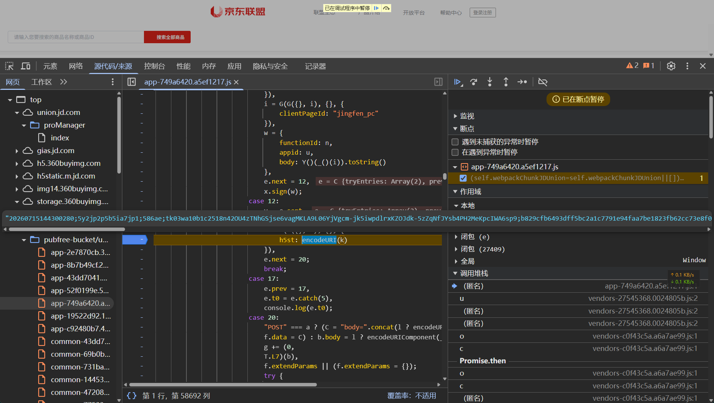
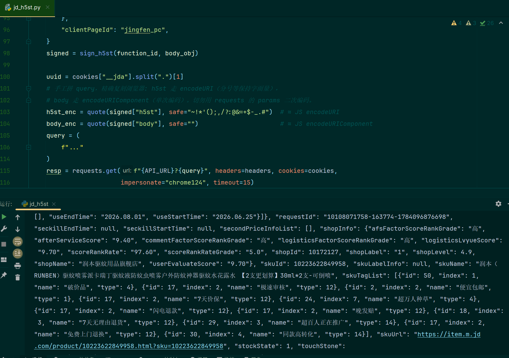

# 京东联盟 h5st(5.3) 逆向实录：从字节码 VM 到 Node 补环境签名

> 目标：复现 `union.jd.com/proManager/index` 页面请求 `api.m.jd.com/api` 时携带的 `h5st` 参数，
> 让纯脚本（Python 发包）能稳定拉到 `unionSearchRecommend` 商品数据。
>
> 结论先行：h5st 的核心签名跑在**自定义字节码 VM** 上，且内置 SHA256/MD5 常量被魔改，
> 纯 Python 复现性价比极低；最终采用 **Node 补环境**直接复用官方 `ParamsSign` 产出签名，
> 配合 **curl_cffi** 绕过 TLS 指纹 WAF，端到端稳定返回 `code=200 message=success`。

---

## 0. 环境与目标接口

- 站点：`https://union.jd.com/proManager/index`（京东联盟 PC 端）
- 接口：`GET https://api.m.jd.com/api`
- 关键请求参数：`functionId / appid / uuid / h5st / body`，其中 **h5st 是唯一的加固点**。

一条真实成功请求的 h5st（脱敏）长这样，用 `;` 分成 **10 段**：

```
20260714233124666;jjnnei5m1byjnnz6;586ae;tk06wedb64bfd41lf...;205c312a...;5.3;1784043079666;q3EpJTIN9yFR...;72a3f882...;of7rHGH...
```

| 段位 | 示例 | 含义 |
|----|----|----|
| part1 | `20260714233124666` | 时间戳，格式 `yyyyMMddHHmmssSSS` |
| part2 | `jjnnei5m1byjnnz6` | fingerprint（16 位，环境指纹） |
| part3 | `586ae` | appId（联盟 PC 固定） |
| part4 | `tk06w...` | token（本地生成的 tk06 令牌） |
| part5 | `205c312a...`(64hex) | key 哈希 |
| part6 | `5.3` | 版本号 |
| part7 | `1784043079666` | 毫秒时间戳 |
| part8 | `q3EpJTIN...` | 环境采集 blob（envSign） |
| part9 | `72a3f882...`(64hex) | 最终签名 |
| part10 | `of7rHGH...` | 固定尾串 |

---

## 1. 定位签名入口

在 XHR 断点 / 调用栈里跟到业务代码（union 的 webpack 包 `app-*.js`）中构造请求的地方：

```js
x = new window.ParamsSign({ appId: "586ae" }),
i = G(G({}, i), {}, { clientPageId: "jingfen_pc" }),
w = { functionId: n, appid: u, body: Y()(_()(i)).toString() },
y = await x.sign(w),
k = y.h5st,
b = G(G({}, b), {}, { h5st: encodeURI(k) })   // ← h5st 落到 URL
```

两个信息量很大的点：

1. **签名器是 `window.ParamsSign`**，来自
   `https://storage.360buyimg.com/webcontainer/js_security_v3_0.1.5.js`（435KB，混淆）。
2. **签的不是原始 body**，而是 `Y()(_()(i)).toString()`——`_` 是 `JSON.stringify`，
   `Y` 后面会验证是「魔改 SHA256」。

---

## 2. 白盒：把 ParamsSign 内部翻出来

直接在页面里实例化并 dump 原型/内部字段：

```js
const x = new window.ParamsSign({ appId: "586ae" });
Object.getOwnPropertyNames(x)            // _token,_fingerprint,_appId,_version,_algos,__genKey...
Object.getOwnPropertyNames(x.__proto__)  // ...sign, signSync, _$sdnmd, _$gs, _$gsd ...
```

意外收获——`__genKey` 是明文的：

```js
function genKey(tk, fp, ts, ai, algo){
  var rd = 'OqCq1v4AQSQJ';
  var str = "".concat(tk).concat(fp).concat(ts).concat(ai).concat(rd);
  return algo.SHA256(str);   // 注意：这个 SHA256 不是标准的
}
```

于是 key 的公式浮出水面：**`SHA256(token + fp + ts + appId + rd)`**。

### 2.1 hook `_algos` 抓 genKey 的真实入参

在一次 `sign` 里 hook `x._algos.SHA256`，抓到唯一一条含 `rd` 的调用：

```
SHA256("tk03w63...yyvDG" + "jjnnei5m1byjnnz6" + "2026071423335928754" + "586ae" + "OqCq1v4AQSQJ")
```

对比同次 h5st 的 part1（`20260714233359287`）发现规律：

```
genKey 的 ts = part1 + "54"      // "54" 是固定后缀，实测 3 组数据全部吻合
```

即 **`key = SHA256(token + fp + (part1 + "54") + appId + rd)`**。
`rd` 由服务端 `cactus.jd.com/request_algo` 下发（默认本地值 `OqCq1v4AQSQJ`）。

---

## 3. 两个「坑中坑」：魔改哈希 + 字节码 VM

### 3.1 SHA256 / MD5 常量被魔改

想用 Python `hashlib` 复现 key，怎么算都对不上。用已知向量一测：

```js
x._algos.SHA256("abc")  // = 448fdf22009f01af476a18c5fc4499c30aa84674afbc2cd9b6b7a19454c7b10a
x._algos.MD5("abc")     // = 2b03aa0aa24abb8d275bb0a0c6069eb2
```

而标准值是 `SHA256("abc")=ba7816bf...`、`MD5("abc")=90015098...`。
**JD 篡改了哈希算法的初始常量 / 轮常量**——这是经典的反逆向手段，
`hashlib` 直接废掉，除非把魔改常量整套抠出来重写。

### 3.2 part5 / part9 跑在自定义字节码 VM 里

hook `_algos` 时只截到 genKey 一次 SHA256，说明 **part5、part9 用的是 bundle 内部另一套 crypto**。
翻 `_$sdnmd`（signSync 的实际实现）：

```js
_$PI.prototype._$sdnmd = function (_$Pd) {
  var s = [];         // 操作数栈
  var n = 4998;       // 指令指针
  for (;;) {
    switch (u[n++]) { // u 是字节码数组
      case 5:  s.push(Date); break;
      case 27: a = s.pop(); s[s.length-1] += a; break;   // add
      case 54: return s.pop();                            // ret
      case 80: s[s.length-2] = s[s.length-2][s[s.length-1]]; s.length--; break;
      ...
    }
  }
};
```

这是 **VMP 风格的栈式虚拟机**——签名逻辑被编译成字节码在解释器里跑。
静态 port 到 Python 成本极高，且和 3.1 的魔改哈希叠加，纯算法复现基本不现实。

**决策：放弃纯 Python，改用 Node 补环境，直接复用官方 `ParamsSign` 的 VM。**

---

## 4. Node 补环境：让 js_security 在 Node 里跑起来

思路：用 Node `vm` 模块建一个「浏览器上下文」，塞进 `window/document/navigator/screen/...`，
把原始 `js_security_v3_0.1.5.js` 加载进去，拿到 `window.ParamsSign` 直接签。

```js
const vm = require('vm');
const win = makeEnv();                 // 见下文的环境 shim
const ctx = vm.createContext(win);
vm.runInContext(fs.readFileSync('js_security_v3_0.1.5.js','utf8'), ctx);
// win.ParamsSign 就绪
const x = new win.ParamsSign({ appId: "586ae" });
const bodyHash = String(x._algos.SHA256(bodyJson));  // 用它自己的魔改 SHA256 处理 body
const r = x.signSync({ functionId, appid, body: bodyHash });
// r.h5st 即所需签名
```

### 4.1 环境 shim 要点

bundle 在加载/签名时会访问大量浏览器 API，逐个补齐即可（缺啥补啥）：

- `window / self / top / parent / globalThis`、`navigator`（UA、platform、hardwareConcurrency…）、
  `screen`、`location`、`localStorage/sessionStorage`、`history`、`performance`。
- **DOM 构造器**：`Element / HTMLElement / Document / Node` 及其 `prototype`——
  bundle 会 patch 这些原型（`Element.prototype.scrollIntoViewIfNeeded`、`window.getComputedStyle` 等）。
- `document.createElement/createTextNode/querySelector...`、`canvas.getContext` 桩。
- **网络桩**：`XMLHttpRequest / fetch` 置空——本地 tk06 令牌路径不需要真实请求
  （`request_algo` / `behavior_report` 静默失败无所谓）。

### 4.2 致命坑：不要覆盖 vm 上下文的内置 intrinsics

第一版签出来 part1 是 `yyyy0714234917821`——**年份没被替换，字面量 `yyyy` 漏了出来**。

根因在日期格式化函数：

```js
/(y+)/i.test(fmt) && (fmt = fmt.replace(RegExp.$1, (""+d.getFullYear()).substr(4 - RegExp.$1.length)));
```

它用了**遗留静态属性 `RegExp.$1`**。在 shim 里画蛇添足写了 `win.RegExp = RegExp`（宿主的），
于是：

- 正则**字面量** `/(y+)/i` 用的是 vm 上下文自带的 intrinsic RegExp，`.test()` 把 `$1` 写在**它**身上；
- 代码里 `RegExp.$1` 读的却是 `win.RegExp`（宿主 RegExp）的 `$1` → 读到空 → 年份替换失败。

> 月/日/时用的是 `new RegExp("("+k+")")`，走的是 `win.RegExp`，读写一致，所以只有年份翻车——很隐蔽。

**修复：删掉所有对内置 intrinsics（Date/RegExp/Math/JSON/Promise…）的覆盖**，
vm.createContext 本来就提供了一套自洽的内置对象，别去污染它。改完 part1 立刻正常。

修复后 Node 产出的 h5st 用的是 **tk06 本地令牌**——和页面真实成功请求同一条路径，结构完全对齐。

---

## 5. 发包：两个编码陷阱 + 一道 TLS 指纹墙

拿到 h5st 后用 Python 发包，接连踩了三个坑：

### 5.1 body 是「魔改 SHA256(json)」，且只能单次编码

- 传给 `sign` 的 `body` = `SHA256(JSON.stringify(bodyObj))`（bundle 的魔改 SHA256，64 hex）；
- URL 上发送的 `body` = **原始 JSON**，`encodeURIComponent` **单次**编码。

一开始用 `URLSearchParams` 又把已 `encodeURIComponent` 的串编码了一遍 → **双重编码**
（`%7B` 变 `%257B`），服务端对不上 SHA256 → `{"code":400,"message":"参数异常"}`。
对照抓包才发现浏览器发的是单次编码的 `%7B%22funName%22...`。

### 5.2 h5st 用 encodeURI（分号保持字面量）

浏览器侧是 `h5st: encodeURI(k)`，分号 `;` 不编码。手工拼 query 时对齐：

```python
h5st_enc = quote(signed["h5st"], safe="~!*'();,/?:@&=+$-_.#")  # ≈ JS encodeURI
body_enc = quote(signed["body"], safe="")                      # ≈ JS encodeURIComponent
```

### 5.3 403 的真凶：TLS 指纹（JA3）WAF

headers、cookies 全部对齐浏览器后，`requests` 依旧 **恒 403**，而浏览器同参数 200。
典型的 **TLS 指纹拦截**——`api.m.jd.com` 的 WAF 按 JA3 识别非浏览器客户端。

换 **curl_cffi** 模拟 Chrome 指纹，一发入魂：

```python
from curl_cffi import requests
resp = requests.get(url, headers=headers, cookies=cookies, impersonate="chrome124")
# HTTP 200  code=200  message=success
```

---

## 6. 最终架构

```
jd_h5st.py (curl_cffi, 纯发包)
      │  subprocess 调用，传 {functionId, appid, appId, bodyJson}
      ▼
jd_sign.js (Node vm 补环境)
      │  加载
      ▼
js_security_v3_0.1.5.js (官方原始 bundle, 字节码 VM + 魔改哈希)
      │  产出
      ▼
 h5st (tk06 本地令牌路径)
```

- **签名交给官方 VM**：绕开魔改哈希与字节码逆向，天然正确、随版本自动兼容。
- **发包纯 Python**：curl_cffi 过 TLS 指纹墙，body 魔改 SHA256 由 Node 侧顺手算好回传。
- 实测连续翻页 `pageNo=1/2/3` 均 `code=200`，每页 50 条商品数据。

---

## 7. 复盘与经验

1. **先白盒 dump 对象，再决定黑/白盒**——`__genKey` 明文、`_algos` 可 hook，
   省掉大量盲猜；而 `_$sdnmd` 一看是 VM 就果断转 Node 补环境，不硬啃字节码。
2. **哈希对不上先验证算法本身**——用 `"abc"` 等已知向量测一下，
   魔改常量能第一时间暴露，别浪费时间怀疑拼接顺序。
3. **Node 补环境要警惕 realm 割裂**——正则字面量与 `new RegExp`、
   `RegExp.$1` 这类遗留静态量，跨 vm 上下文极易踩坑；**不要覆盖内置 intrinsics**。
4. **编码只做一次**——手工拼 query，对齐浏览器的 `encodeURI` / `encodeURIComponent`，
   别让请求库二次编码。
5. **200 之前先排除 TLS 指纹**——headers/cookies 全对却 403，八成是 JA3，curl_cffi 是标配。

---

## 附：关键文件

| 文件 | 作用 |
|----|----|
| `jd_h5st.py` | 主程序，curl_cffi 发包 + 调 Node 签名 |
| `jd_sign.js` | Node vm 补环境签名器，加载官方 bundle 产出 h5st |
| `js_security_v3_0.1.5.js` | 京东官方原始签名 bundle（字节码 VM + 魔改哈希） |

> 免责声明：本文仅用于技术研究与学习，请勿用于任何违反目标站点服务条款的用途。
> Cookie 为临时会话数据，过期自行替换（`__jda/__jdu` 决定 `uuid`）。
