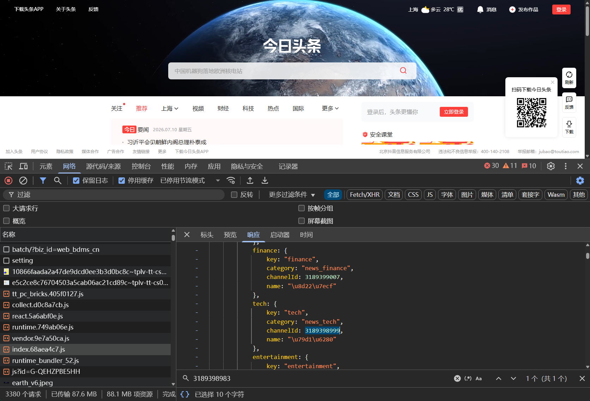
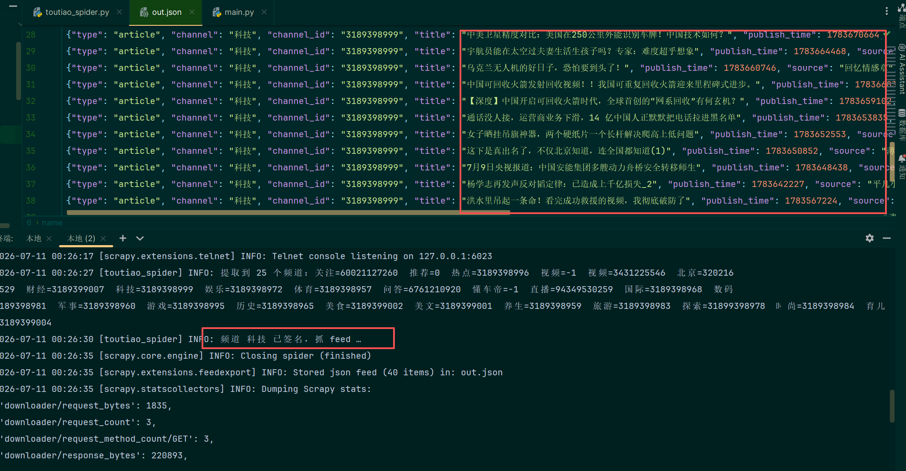

CrawlSpider 是 Scrapy 中专门用于全站爬取或按规则自动跟踪链接的爬虫类。它继承自 scrapy.Spider，核心优势是通过定义 rules（规则）和 LinkExtractor（链接提取器），自动发现并跟进符合条件的链接，无需手动编写翻页或列表页跳转逻辑。
CrawlSpider 使用教程：
### 1. 核心概念

| 组件 | 作用 |
| :--- | :--- |
| `Rule` | 定义链接提取与处理的规则，包含链接提取器、回调函数、是否跟进等参数 |
| `LinkExtractor` | 从响应中提取符合特定模式（正则/CSS/XPath）的链接 |
| `callback` | 匹配到链接后调用的解析方法（⚠️ 不能命名为 `parse`） |
| `follow` | 是否继续从该链接提取新链接（默认 `False`；若未指定 `callback` 则默认为 `True`） |
_⚠️ 关键警告：CrawlSpider 内部已占用 parse() 方法来处理规则调度，切勿重写 parse()，否则会导致爬虫失效。所有数据解析方法应使用其他名称（如 parse_item、parse_detail）。_
### 2. 完整示例：爬取新闻网站

    scrapy genspider -t crawl toutiao_spider www.toutiao.com
    会创建一个toutiao_spider.py文件,
    在网页找到涵盖所有频道的channelId文件

    
脚本这样写：
```python
# -*- coding: utf-8 -*-
"""
今日头条 Scrapy CrawlSpider

流程：
  1) 请求 https://www.toutiao.com/?wid=<毫秒时间戳>  → 返回含应用 bundle 的完整 HTML
     （不带 wid 只返回 4.9KB 壳页，壳页会用 JS 重定向补上 wid 再加载应用）
  2) CrawlSpider Rule 用 LinkExtractor 从 <script src> 里提取并跟进
     pages/newsIndex/index.<hash>.js
  3) parse_channels：正则从该 JS 里提取各板块(频道)的 channel_id / key / category / name
  4) 可选：对指定频道调 node(sign_feed.js) 生成 msToken+a_bogus 签名 URL，抓 feed 并解析文章

运行：
  # 只提取频道 -> toutiao_out.json
  python toutiao_spider.py
  scrapy runspider toutiao_spider.py -o channels.json
  # 额外抓某些频道 feed（逗号分隔 key，如 hot,tech,world）
  scrapy runspider toutiao_spider.py -a feed_channels=hot,tech -o out.json
  # 或： set FEED_CHANNELS=hot,tech && python toutiao_spider.py

依赖：pip install scrapy ；node 环境（get_mstoken.js / sign_feed.js 与本文件同目录）
"""
import os
import re
import time
import json
import subprocess

import scrapy
from scrapy.spiders import CrawlSpider, Rule
from scrapy.linkextractors import LinkExtractor

BASE_DIR = os.path.dirname(os.path.abspath(__file__))


class ToutiaoSpiderSpider(CrawlSpider):
    name = "toutiao_spider"
    allowed_domains = ["toutiao.com", "toutiaostatic.com"]

    custom_settings = {
        "ROBOTSTXT_OBEY": False,
        "DOWNLOAD_DELAY": 0.5,
        "CONCURRENT_REQUESTS": 4,
        "RETRY_TIMES": 2,
        "USER_AGENT": (
            "Mozilla/5.0 (Windows NT 10.0; Win64; x64) AppleWebKit/537.36 "
            "(KHTML, like Gecko) Chrome/136.0.0.0 Safari/537.36"
        ),
        "DEFAULT_REQUEST_HEADERS": {
            "accept": "application/json, text/plain, */*",
            "accept-language": "zh-CN,zh;q=0.9",
            "referer": "https://www.toutiao.com/",
        },
        "LOG_LEVEL": "INFO",
    }

    # CrawlSpider 规则：从首页 HTML 的 <script src> 里提取 newsIndex/index.<hash>.js 并跟进。
    # 注意：LinkExtractor 默认 deny_extensions 会忽略 .js，需清空；默认只看 <a href>，改成 <script src>。
    rules = (
        Rule(
            LinkExtractor(
                tags=("script",),
                attrs=("src",),
                allow=r"newsIndex/index\.\w+\.js",
                deny_extensions=[],
            ),
            callback="parse_channels",
            follow=False,
        ),
    )

    # 频道对象在 JS 里形如：key:"world",category:"news_world",channelId:3189398968,name:"国际"
    CH_RE = re.compile(r'key:"(\w+)",category:"([^"]+)",channelId:(-?\d+),name:"([^"]*)"')

    def __init__(self, feed_channels="", max_items=20, *args, **kwargs):
        super().__init__(*args, **kwargs)
        # feed_channels: 逗号分隔的频道 key（如 "hot,tech,world"），指定则额外抓这些频道 feed
        self.feed_channels = [c.strip() for c in str(feed_channels).split(",") if c.strip()]
        self.max_items = int(max_items)
        self.channels = {}

    async def start(self):
        # Scrapy 2.13+ 用异步 start() 取代 start_requests()
        wid = int(time.time() * 1000)
        # 带 wid 才返回含应用 bundle 的完整 HTML
        yield scrapy.Request(f"https://www.toutiao.com/?wid={wid}", dont_filter=True)

    # ---------------- 频道提取（本次核心） ----------------
    def parse_channels(self, response):
        for m in self.CH_RE.finditer(response.text):
            key, category, cid, name = m.groups()
            try:
                name = json.loads('"' + name + '"')  # 解 \uXXXX 转义
            except Exception:
                pass
            ch = {"key": key, "name": name, "channel_id": cid, "category": category}
            self.channels[key] = ch
            yield {"type": "channel", **ch}   # ① 频道 item（channel_id 在这里产出）

        self.logger.info(
            "提取到 %d 个频道：%s",
            len(self.channels),
            "  ".join(f"{c['name']}={c['channel_id']}" for c in self.channels.values()),
        )

        # ② 可选：对指定频道抓 feed
        for key in self.feed_channels:
            ch = self.channels.get(key)
            if not ch:
                self.logger.warning("未找到频道 key=%s（可用: %s）", key, ",".join(self.channels))
                continue
            if ch["channel_id"] == "-1":
                self.logger.info("频道 %s 是外链(西瓜/懂车帝)，跳过 feed", ch["name"])
                continue
            try:
                yield self.build_feed_request(ch)
            except Exception as e:
                self.logger.error("频道 %s 签名失败：%s", ch["name"], e)

    # ---------------- feed 抓取（需 node 签名 msToken + a_bogus） ----------------
    def build_feed_request(self, ch):
        cid = ch["channel_id"]
        # 推荐频道(channel_id=0)用 pc_profile_recommend，其余用 pc_profile_channel
        category = "pc_profile_recommend" if cid == "0" else "pc_profile_channel"
        params = {
            "channel_id": cid,
            "min_behot_time": str(int(time.time())),
            "offset": "0",
            "refresh_count": "1",
            "category": category,
            "client_extra_params": '{"short_video_item":"filter"}',
            "aid": "24",
            "app_name": "toutiao_web",
        }
        signed = self._sign_feed(params)  # 阻塞调用 node（jsdom 补环境，约 3~5s）
        self.logger.info("频道 %s 已签名，抓 feed …", ch["name"])
        # 必须用 node 签好的完整 url 原样请求（a_bogus 依赖精确 query，不能重拼）
        return scrapy.Request(
            signed["url"], callback=self.parse_feed,
            meta={"channel": ch}, dont_filter=True,
        )

    def _sign_feed(self, params):
        out = subprocess.check_output(
            ["node", "sign_feed.js", json.dumps(params, ensure_ascii=False)],
            cwd=BASE_DIR, timeout=60,
        )
        return json.loads(out.decode("utf-8", "ignore").strip().splitlines()[-1])

    def parse_feed(self, response):
        ch = response.meta["channel"]
        try:
            data = json.loads(response.text).get("data", [])
        except Exception:
            self.logger.error("频道 %s feed 解析失败：%s", ch["name"], response.text[:200])
            return
        # 过滤广告/无标题卡片，按 publish_time(真实发布时间) 降序，最新在前
        arts = [it for it in data if it.get("publish_time") and it.get("title")]
        arts.sort(key=lambda it: int(it["publish_time"]), reverse=True)
        for it in arts[: self.max_items]:
            yield {
                "type": "article",
                "channel": ch["name"],
                "channel_id": ch["channel_id"],
                "title": it["title"],
                "publish_time": int(it["publish_time"]),
                "source": it.get("source", ""),
                "url": it.get("article_url", ""),
            }


if __name__ == "__main__":
    from scrapy.crawler import CrawlerProcess

    process = CrawlerProcess(settings={
        "FEEDS": {
            "toutiao_out.json": {
                "format": "json", "overwrite": True,
                "encoding": "utf8", "indent": 2,
            },
        },
    })
    process.crawl(ToutiaoSpiderSpider, feed_channels=os.environ.get("FEED_CHANNELS", ""))
    process.start()


# # 只提取频道（快，~10s）→ toutiao_out.json
# python toutiao_spider.py
#
# # 额外抓指定频道的 feed（每频道 node 签名约 3~5s）
# scrapy runspider toutiao_spider.py -a feed_channels=hot,tech -o out.json
# #  或   set FEED_CHANNELS=hot,tech && python toutiao_spider.py
```


    注意rules是提取频道,
    指定科技板块并输出到out.json：
        scrapy runspider toutiao_spider.py -a feed_channels=tech -o out.json


    通过学习Scrapy-CrawlSpider，理解了按规则解析不同板块，实现全站爬取