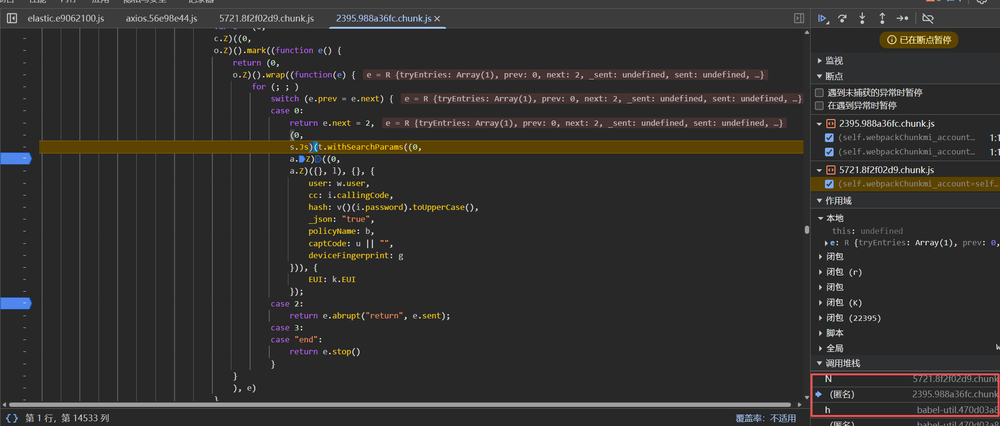
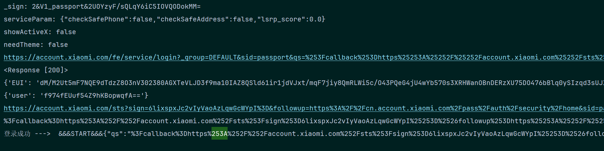

## 小米登录账号密码逆向

### 一、参数分析
    
    url = "https://account.xiaomi.com/pass/serviceLoginAuth2"
    登录接口 headers、data 分析：
```python

headers = {
    "Accept": "application/json, text/plain, */*",
    "Content-Type": "application/x-www-form-urlencoded; charset=UTF-8",
    "EUI": "YHlKq8W6s2psCxm0GopgyroyokbqxpdjvMJ1nmVzRURy84NgdZfrKzZ54iWsBxDYRMdxOT8hHvJlHwTWeHo2BtO+JWZyopKycehJCX4Ngxz3wLEyWggUVe6bZHXiQPCBRX0skaKtAQVXvRyoUpuyYYA8AjRG2WeQvBumnx4Ft1U=.dXNlcg==",
    "Origin": "https://account.xiaomi.com",
    "Referer": "https://account.xiaomi.com/fe/service/login/password?_locale=zh_TW&sid=passport&qs=%253F_locale%253Dzh_TW&callback=https%3A%2F%2Faccount.xiaomi.com&_sign=2%26V1_passport%26UgW1VrTCf%2Fg8opP%2FsVyd2ajewrE%3D&serviceParam=%7B%22checkSafePhone%22%3Afalse%2C%22checkSafeAddress%22%3Afalse%2C%22lsrp_score%22%3A0.0%7D&showActiveX=false&theme=&needTheme=false&bizDeviceType=",
}
cookies = {
    "deviceId": "wb_81bb086f-66d4-459a-bcc0-c603e7f649ea",
}
data = {
    "bizDeviceType": "",
    "needTheme": "false",
    "theme": "",
    "showActiveX": "false",
    "serviceParam": "{\"checkSafePhone\":false,\"checkSafeAddress\":false,\"lsrp_score\":0.0}",
    "callback": "https://account.xiaomi.com",
    "qs": "%3F_locale%3Dzh_TW",
    "sid": "passport",
    "_sign": "2&V1_passport&UgW1VrTCf/g8opP/sVyd2ajewrE=",
    "user": "fHEFAIWR3san4vXKe3EKUQ==",
    "cc": "+86",
    "hash": "4297F44B13955235245B2497399D7A93",
    "_json": "true",
    "policyName": "miaccount",
    "captCode": "",
    "deviceFingerprint": "7107935223f7907ec083c0e301f2aeaf"
}
```
    headers的EUI，data的_sign、deviceFingerprint、user、hash
### 二、堆栈分析
    在启动器打断点，最终定位到

    
    往上找到k = m({user: d})，这个m进入到/js/crypto.17efe504.chunk.js，
    整个crypto js入参{user: '18300568261'}经过了两层处理
    a = o.encrypt(window.btoa(e)) e是随机16位字符，
    先经过Window 接口的 btoa() 方法，然后在o.encrypt生成
```javascript
e
'bgTFsSoMvhkNulb*'
window.btoa(e)
'YmdURnNTb012aGtOdWxiKg=='
o.encrypt(window.btoa(e))
'Jx6Xt+ua9vPxAVIRmmNU0IetCG8yuiQqUQRZgdjoUea3D9siyGYFXVYh/WNr5Zqvtc0ZNIvGIXFgtKroArpPTKBKtEFTx2V9oqEBABxYFrliI0FGOeAEDkEiB0L8pOp28ii6O3eK5nLZBn58IqJgtUoETN+DtV6c3ExolyfcHKs='
 p(this.getKey().encrypt(t))
'KKQhUOKtZ6cnkH5kvrEUcAfYJCWbyox4xv0BCEiVxSq49n3rlle/hMOTSjeSHNWsiT3wt1vl/JXMXX9GekajPobbquu2I9OziPAqURfImC7GsPVybd26cbjsfcIav3nkBRvYxTYVFZd8jG7rD1NzMBYlemhyUa1uFXXN53Jzzgs='
 p(this.getKey().encrypt(t))
'dblnOlVR1IhfeSaE9ySb+2BhPxDYOfY0FKXRtCfrmBk9F/CxPJqlORqJhK9KjYm5uCjILjekP1X3yeb0EhcLdFRdGoaWiXezDhBg5ivnL3pRpEcfliKTvmPzrsinYQnNzWu867KGR3vvYd6oSE6pY5ZfkIkTuWBNZlWBwpp6dNs='
 p(this.getKey().encrypt(t))
'KBK2UBJ0jOHoNZeSIEgIkZ1qjhiqipyw97sXgJi1IuVv18LAxO0Lzhv5uYv9Sga+dYhBTw8jajpEbjYcFJ0ZGWfiEWyXSQn94QcgFrwIddjH9ihidov3oNqphkCqYc0wdcJge+iYbLTKfmkGqLAyCkrvzAU8ZP2PE0d1GOUlLpo='
this.getKey().encrypt(t)
'1fcde14248cb980e1eab4c9335552d7bf7232186265686faed3a537b17bd564e2662be6bfe55b84533104d36c15a0db10464176b7044ac998928636043a915902318b48cd4373abcbc6ea6698b886c26f26510a3739a89e32fd48522cbf0b687ca6a550edc9d4c60cd32a48253ce91c5233142970419b6e0e9a259039d7f4032'
this.getKey().encrypt(t)
'6ef10e9c404395114836ca5ae2d75b788fb586260d88540127a92b85201e100b942b17b8ab56a0b7ed99985249a494e172a0dbedd6d7423e90b7fc8edeaf9383e57c3cccba596042531428fe495831e08719b8679cba954fdda0fc9af0ab089483dd9244ed291ae97f59faa5efad99ca7193776983b7661f295d30294d844ea4'
```
    每次都在变化，判断a的处理流程：
        e是function(n) return 随机16位字符
        window.btoa(e)编码为Base64 编码的ASCII字符串
        this.getKey().encrypt(t) 做RSA加密 长度256
        p(this.getKey().encrypt(t))转换为 Base64 编码的字符串 = a
    
    那么EUI: "".concat(a, ".").concat(B)处理完了。
    
    参数user-->encryptedParams: u 这个参数，往上定位
        o = r().encrypt(t, Q, {
            iv: i,
            padding: A()
        });
        就是AES加密的了
    参数hash猜测是密码MD5，用字符123验证了一下，确实每次都生成123 -> 202cb962ac59075b964b07152d234b70
    _sign 是经过https://account.xiaomi.com/ 302两次跳转，在连接中：https://cn.account.xiaomi.com/fe/service/login/password?_group=DEFAULT&_sign=y4csmComcZgS a kItlS1mrFw98=&serviceParam={"checkSafePhone":false,"checkSafeAddress":false,"lsrp_score":0.0}&showActiveX=false&theme=&needTheme=false&bizDeviceType=&_locale=zh_CN&_callingCode= 86&_agreementChecked=true&source=&region=CN&sid=xiaomichatbot&qs=?callback=https://aistudio.xiaomimimo.com/sts?sign=u2csOOZV5GZNrWSaYGFRyMjxNiE=&followup=https://aistudio.xiaomimimo.com/#&sid=xiaomichatbot&callback=https://aistudio.xiaomimimo.com/sts?sign=u2csOOZV5GZNrWSaYGFRyMjxNiE=&followup=https://aistudio.xiaomimimo.com/#&_uRegion=CN


### 三、脚本请求
```python
import requests
from urllib.parse import urlparse, parse_qs
import execjs
import hashlib

class XiaoMi:
    def __init__(self, mobile, password):
        self.mobile = mobile
        # 密码在初始化时即进行MD5加密，符合登录接口要求
        self.password = hashlib.md5(password.encode("utf-8")).hexdigest().upper()
        
        self.session = requests.session()
        
        # 初始化必要参数，避免在方法中出现未定义引用
        self._sign = None
        self.serviceParam = None
        self._callback = None
        self._referer = None

    def submit_login(self):
        # --- 第一步：获取登录页面参数 ---
        login_url = "https://cn.account.xiaomi.com/"
        headers = {
            "User-Agent": "Mozilla/5.0 (Windows NT 10.0; Win64; x64) AppleWebKit/537.36",
            "Accept": "text/html,application/xhtml+xml,application/xml;q=0.9,*/*;q=0.8",
            "Accept-Language": "zh-CN,zh;q=0.9",
            "Connection": "keep-alive",
            "Upgrade-Insecure-Requests": "1",
        }
        cookies = {
            "uLocale": "zh_CN",
            "deviceId": "wb_daa83e52-315b-4948-8595-494da27a550e",
            "pass_ua": "web"
        }

        # 发起GET请求获取URL参数
        response = self.session.get(login_url, headers=headers, cookies=cookies)
        
        # 解析URL中的Query参数
        parsed = urlparse(response.url)
        params = parse_qs(parsed.query)
        
        # 提取核心加密参数
        self._sign = params.get("_sign", [""])[0]
        self.serviceParam = params.get("serviceParam", [""])[0]
        self._callback = params.get("callback", [""])[0]
        self._referer = response.url

        # --- 第二步：加载JS生成加密数据 ---
        try:
            with open("./xiaomi/user_crypto.js", "r", encoding="utf-8") as f:
                js_code = f.read()
            ctx = execjs.compile(js_code)
            # 调用JS中的加密函数
            result = ctx.call("get_user", self.mobile)
            encrypted_data = result["encryptedParams"]
        except Exception as e:
            print(f"JS执行错误: {e}")
            return

        # --- 第三步：提交登录请求 ---
        post_url = "https://account.xiaomi.com/pass/serviceLoginAuth2"
        post_headers = {
            "User-Agent": "Mozilla/5.0 (Windows NT 10.0; Win64; x64) AppleWebKit/537.36",
            "Accept": "application/json, text/plain, */*",
            "Content-Type": "application/x-www-form-urlencoded; charset=UTF-8",
            "Origin": "https://account.xiaomi.com",
            "Referer": self._referer,
            "X-Requested-With": "XMLHttpRequest",
            "EUI": result.get("EUI", ""), # 确保EUI存在
        }

        # 构造POST数据
        # 注意：原代码中deviceFingerprint使用了password，这通常是设备指纹，建议核实是否为占位符
        data = {
            "sid": "passport",
            "_sign": self._sign,
            "user": encrypted_data["user"],
            "cc": "+86",
            "hash": self.password,
            "_json": "true",
            "policyName": "miaccount",
            "captCode": "",
            "deviceFingerprint": self.password, # 此处需确认逻辑，通常不应是密码
            # 以下字段根据网页解析内容保持默认或空值
            "needTheme": "false",
            "showActiveX": "false",
            "serviceParam": self.serviceParam,
            "callback": self._callback,
        }

        response = self.session.post(post_url, headers=post_headers, data=data)
        
        # --- 第四步：处理结果 ---
        if response.status_code == 200:
            if "成功" in response.text:
                print("登录成功:", response.text)
            else:
                print("登录失败:", response.text)
        else:
            print(f"请求异常，状态码: {response.status_code}")

if __name__ == '__main__':
    # 实例化并执行
    xiaomi = XiaoMi("13838389438", "123123")
    xiaomi.submit_login()
```
            --->  &&&START&&&{"code":10025,"result":"error","desc":"Callback连接不合法","description":"Callback连接不合法"}
    密码错误 --->  &&&START&&&{"qs":"%3Fcallback%3Dhttps%253A%252F%252Faccount.xiaomi.com%252Fsts%253Fsign%253D6lixspxJc2vIyVaoAzLqwGcWYpI%25253D%2526followup%253Dhttps%25253A%25252F%25252Fcn.account.xiaomi.com%25252Fpass%25252Fauth%25252Fsecurity%25252Fhome%2526sid%253Dpassport%26sid%3Dpassport%26_group%3DDEFAULT","code":70016,"description":"登录验证失败","securityStatus":0,"_sign":"2&V1_passport&2UOYzyF/sQLqY6iC5IOVQODokMM=","sid":"passport","result":"error","miDemo":0,"captchaUrl":null,"callback":"https://account.xiaomi.com/sts?sign=6lixspxJc2vIyVaoAzLqwGcWYpI%3D&followup=https%3A%2F%2Fcn.account.xiaomi.com%2Fpass%2Fauth%2Fsecurity%2Fhome&sid=passport","location":"","pwd":0,"child":0,"desc":"登录验证失败"}
    登录成功 --->  &&&START&&&{"qs":"%3Fcallback%3Dhttps%253A%252F%252Faccount.xiaomi.com%252Fsts%253Fsign%253D6lixspxJc2vIyVaoAzLqwGcWYpI%25253D%2526followup%253Dhttps%25253A%25252F%25252Fcn.account.xiaomi.com%25252Fpass%25252Fauth%25252Fsecurity%25252Fhome%2526sid%253Dpassport%26sid%3Dpassport%26_group%3DDEFAULT","ssecurity":"KGcdySnFAuteHcL/7krBMA==","code":0,"passToken":"V1:DXmurwq2/R1BHTELu6obCaab8Mte5AgfxXg/zSA1XU5wBOHxcSThZUWfFm8DmEeDy0/YrzpzJ92nVokIrug3D1SNrq+KXJ16kRHDrUl1iC1uE+l0jnuFoxOw28hhSUHBBsCBkoCj7RXFCGHjleG0Rc/IEHVU5a16fFgiK+W4mkCu0qd6SKq6BJrebMtshaRqxtgpS4NYrWYcPPatO/5SWUPJXGyPycb3Tb5qur9xsBcsJRuuuvVCXmjDvxwsByW3QY16NDdYxYXKAIRr9zghYZEXOVPO2xgUQQPvIj0O24t3qp3vAhREnb+Geb0dUv/qzicYE7tnfqJjCel7orQtDA==","description":"成功","securityStatus":0,"nonce":4219446600108864512,"userId":2645646278,"cUserId":"htB_N6j3tUPzQAorag7iIYl3ZIM","result":"ok","psecurity":"fVUenF6oho/zy/EagvTO5w==","miDemo":0,"captchaUrl":null,"location":"https://account.xiaomi.com/sts?sign=6lixspxJc2vIyVaoAzLqwGcWYpI%3D&followup=https%3A%2F%2Fcn.account.xiaomi.com%2Fpass%2Fauth%2Fsecurity%2Fhome&sid=passport&d=wb_daa83e52-315b-4948-8595-494da27a550e&ticket=0&pwd=1&p_ts=1777651185529&fid=0&p_lm=1&p_ur=CN&auth=2%26V1_passport%26Q48lSVpxc4QaaM%2Fd1fKlxk2il6COVlgDi5%2Fl6FhTK7tlCsdLxWS3H%2FpzKMqgDyW8ZQvYQJG7wvVUNAjY9TyGQCoOjVFoJo3OYp8XLlgpoJ%2BAuf%2F3aFkK8Z2%2FDzJjZM2z%2FUz1KElPLNVwRZP6yaXtm5aM6vDqktb4qhGjWiYaoc4%3D&m=1&_group=DEFAULT&tsl=0&p_ca=0&p_idc=China&nonce=jyvBq0I%2F%2B58BxBR%2F&_ssign=2%26V1_passport%26JtJQlN%2FUosrO%2Fs9R50YyZiGT5pI%3D","pwd":1,"child":0,"desc":"成功"}
