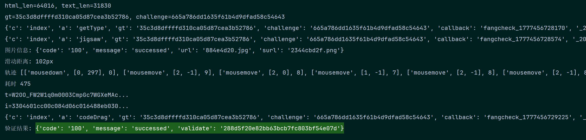

#### 信息：

    网址：https://passport.fang.com/
    验证类型：recaptcha.fang.com 滑块

##### 一、获得gt、challeng

| url  | Method  | result  |
|---|---|---|
| passport.fang.com/web/slider/init  |  POST | gt、challenge |

    这两个参数是https://passport.fang.com/web/slider/init
    POST请求得到的{'code': '100', 'message': 'successed', 'gt': '35c3d8dffffd310ca05d87cea3b52786', 'challenge': 'd535c4ebb58cf88f926015d23c655fe1'}

```python
import requests

class FTX:
    def __init__(self):
        self.base_url = 'https://passport.fang.com/'
        self.session = requests.Session()
        self.session.get(self.base_url)
    def slider_init(self):
        response = self.session.post("https://passport.fang.com/web/slider/init")
        data = response.json()
        gt,challenge = data["gt"],data["challenge"]
        return gt,challenge
if __name__ == '__main__':
    FTX().slider_init()
```

##### 二、图片处理

| url  | Method | payload      | result                                                                                                               |
|---|--------|---|----------------------------------------------------------------------------------------------------------------------|
| https://recaptcha.fang.com  | POST   | {'c': 'index', 'a': 'jigsaw', 'gt': '', 'challenge': '', 'callback': 'fangcheck_1777397393741', '_200226': ''} | fangcheck_1777382559070({"code":"100","message":"successed","url":"1c88f706938f95.jpg","surl":"1c7753dd4a0014.png"}) |
| static.soufunimg.com/common_m/m_recaptcha/jigsawimg/1c88f706938f95.jpg  | GET    |  | png |
    把jsonp的数据处理一下，
```python
import re,json
def extract_jsonp(jsonp_str: str) -> dict:
    """提取 JSONP 数据为 dict"""
    match = re.search(r'\((\{.*\})\)', jsonp_str, re.DOTALL)
    if not match:
        raise ValueError(f"无法提取 JSON: {jsonp_str}")
    return json.loads(match.group(1))
# {'code': '100', 'message': 'successed', 'url': '84bcb3f168eeb.jpg', 'surl': '6ae86ad07c2a2.png'}
```
    然后把图片bg和target保存到本地.png，识别滑动距离
```python
import cv2
def get_verify_bt_opencv(background, target):
    bg_img = cv2.imread(background)  # 背景图片
    tp_img = cv2.imread(target)  # 缺口图片
    bg_edge = cv2.Canny(bg_img, 100, 200)
    tp_edge = cv2.Canny(tp_img, 100, 200)
    bg_pic = cv2.cvtColor(bg_edge, cv2.COLOR_GRAY2RGB)
    tp_pic = cv2.cvtColor(tp_edge, cv2.COLOR_GRAY2RGB)
    res = cv2.matchTemplate(bg_pic, tp_pic, cv2.TM_CCOEFF_NORMED)
    min_val, max_val, min_loc, max_loc = cv2.minMaxLoc(res)  # 寻找最优匹配
    X = max_loc[0]
    return X
```
    前期的准备算是处理完了
##### 三、验证参数分析
    
| url  | Method | payload                                                                                                                                                     | result                                                                                                               |
|---|--------|-------------------------------------------------------------------------------------------------------------------------------------------------------------|----------------------------------------------------------------------------------------------------------------------|
| https://recaptcha.fang.com/  | POST   | {'c': 'index', 'a': 'codeDrag', 'start': '开始时间', 'end': '结束时间', 'i': '', 't': '-m', 'gt': '', 'challenge': '', 'callback': 'fangcheck_{time}', '_200226': ''} | fangcheck_1777398188213({"code":"102","message":"10!"}) |
    参数如下，
        i---> 3302606c02c01c084365600180ac703081953046741ec05b001c043005ce39804e1c960e249ba04e1023821d5b626660e2102017800b00b4e801c9c715364c0938e9c0e7002cbe11012c00d9ed20148400311400e8909a4002803a8e8076004df007700ce37a40151bf45646c00042368e4e90c1612048001e900094360082c4c47a00a6f699004600d23ae426e6c000ec163436b6f90012be1a003226e8367a3a00d6993600e29900c61df8c9b1e862004e44dd66383456f3d6b198a40066a4e33a2528e59560aa826a2860023810fc87c774c0ecfb2a074a7711a02c4ab00f70ca70000a0022a6006a3a4cbb932e316b39c8a0a7290f412620b85612001b9024160903a0c693422657e00d4683c14e4878da1b0f862251c0c2462b1441d0015d0878c0753d1e80854261708472209ec8d0e9fa934f3e056e400288b800e6b8bfab2d144925927994fe4b4720522ae419fa720499c78a5573c9bcaa5a25e9f7bac43e771c1941dd7280e0a02868230608b7417a502d2f57b802d7a194fd2d14086312050c62bdf420f0020f1c4c634ebe8c42193e80ccb5b331ea1209040000
        i长度：832
        t---> W3mO_FZuKe0n4m0mS30CC0F13O10WGsWOXeU7WGXuDO47XuWGU7Xu68Ru48U7Xu48WGVt47Y11n0IPOSG1u47W2N03F0pp3000p3WG0MD3WOLe45WGCXA10qWGE112WOGZWW51Kc92E40HmO93mG8000F02LWPcPcOpC9020mC0C5030m0m80C9030m0n00-m
        t长度：193
    搜索参数challenge，找到一处位置，打断点，


    start/end是滑动轨迹生成的时间大数组初/末。
    end - start = 轨迹耗时
--------------------------------------------------------
    看i的函数：
```javascript
i: x.compress(function(e) {
    var u = f
      , g = u;
    void 0 === g.wd && (g.wd = 0);
    var n = function() {};
    n.performanceTiming = function(){},
    n.timestamp = (new Date).getTime(),
    n.cwidth = e;
    var r = [];
    return ["textLength", "HTMLLength", "documentMode"].concat(k).concat(["screenLeft", "screenTop", "screenAvailLeft", "screenAvailTop", "innerWidth", "innerHeight", "outerWidth", "outerHeight", "browserLanguage", "browserLanguages", "systemLanguage", "devicePixelRatio", "colorDepth", "userAgent", "cookieEnabled", "netEnabled", "screenWidth", "screenHeight", "screenAvailWidth", "screenAvailHeight", "localStorageEnabled", "sessionStorageEnabled", "indexedDBEnabled", "CPUClass", "platform", "doNotTrack", "timezone", "canvas2DFP", "canvas3DFP", "plugins", "maxTouchPoints", "flashEnabled", "javaEnabled", "hardwareConcurrency", "jsFonts", "timestamp", "performanceTiming", "cwidth"]).map(function(e) {
        var t = n[e];
        r.push(void 0 === t ? -1 : t)
    }),
    encodeURIComponent(r.join("!!"))
}(s.container.width()))
```
    打断发现x.compress的入参其实是："32648!!73235!!CSS1Compat!!!!313!!63!!0!!0!!1924!!150!!1940!!1246!!zh-CN!!zh-CN!!-1!!1!!24!!Mozilla/5.0 (Windows NT 10.0; Win64; x64) AppleWebKit/537.36 (KHTML, like Gecko) Chrome/136.0.0.0 Safari/537.36!!1!!1!!2560!!1440!!2560!!1392!!1!!1!!1!!-1!!Win32!!0!!-8!!-1!!-1!!PDFViewer,internal-pdf-viewer,ChromePDFViewer,internal-pdf-viewer,ChromiumPDFViewer,internal-pdf-viewer,MicrosoftEdgePDFViewer,internal-pdf-viewer,WebKitbuilt-inPDF,internal-pdf-viewer!!0!!-1!!1!!20!!-1!!1777399235134!!0,0,5,0,0,3,107,0,57,2,0,0,10,134,134,145,684,684,684,0!!300"
    x.compress("32648!!73235!!CSS1Compat!!!!313!!63!!0!!0!!1924!!150!!1940!!1246!!zh-CN!!zh-CN!!-1!!1!!24!!Mozilla%2F5.0%20(Windows%20NT%2010.0%3B%20Win64%3B%20x64)%20AppleWebKit%2F537.36%20(KHTML%2C%20like%20Gecko)%20Chrome%2F136.0.0.0%20Safari%2F537.36!!1!!1!!2560!!1440!!2560!!1392!!1!!1!!1!!-1!!Win32!!0!!-8!!-1!!-1!!PDFViewer%2Cinternal-pdf-viewer%2CChromePDFViewer%2Cinternal-pdf-viewer%2CChromiumPDFViewer%2Cinternal-pdf-viewer%2CMicrosoftEdgePDFViewer%2Cinternal-pdf-viewer%2CWebKitbuilt-inPDF%2Cinternal-pdf-viewer!!0!!-1!!1!!20!!-1!!1777399235134!!0%2C0%2C5%2C0%2C0%2C3%2C107%2C0%2C57%2C2%2C0%2C0%2C10%2C134%2C134%2C145%2C684%2C684%2C684%2C0!!300")
    看来i是一些环境校验，请求头，图片长度，网页字符长度等明文经过x.compress得到：'3302606c02c01c08430eca60138c00500751d00ec009474c84dc1acc482675461944160884687c40300...'
    x.compress 本质-->
        输入字符串
            ↓
        LZString 变种压缩（baseCompress，位宽=16）
            ↓
        每个压缩单元用 toChart16 转成4位十六进制
            ↓
        输出：很长的十六进制字符串（小写）
--------------------------------------------------------
    在分析t的函数，流程如下：


        轨迹数组 e[]
            ↓
        ① 拆分四个数组（事件类型、时间戳、x坐标、y坐标）
            ↓
        ② 各自压缩编码
            ↓
        ③ 拼接成二进制字符串
            ↓
        ④ 每6位转一个Base64字符
            ↓
        "W2aO_FWoW1uG3mD..."

##### 四、全部代码
    
```python
import json
import os
import re
import time
import random
import cv2
import requests
import execjs

os.environ["PYTHONUTF8"] = "1"
os.environ["PYTHONIOENCODING"] = "utf-8"


# ==================== 工具函数 ====================

def extract_jsonp(jsonp_str: str) -> dict:
    match = re.search(r'\((\{.*\})\)', jsonp_str, re.DOTALL)
    if not match:
        raise ValueError(f"无法提取 JSON: {jsonp_str}")
    return json.loads(match.group(1))


def get_verify_bt_opencv(background: str, target: str) -> int:
    bg_img = cv2.imread(background)
    tp_img = cv2.imread(target)
    bg_edge = cv2.Canny(bg_img, 100, 200)
    tp_edge = cv2.Canny(tp_img, 100, 200)
    bg_pic = cv2.cvtColor(bg_edge, cv2.COLOR_GRAY2RGB)
    tp_pic = cv2.cvtColor(tp_edge, cv2.COLOR_GRAY2RGB)
    res = cv2.matchTemplate(bg_pic, tp_pic, cv2.TM_CCOEFF_NORMED)
    _, _, _, max_loc = cv2.minMaxLoc(res)
    return max_loc[0]


# ==================== 轨迹生成 ====================

def _gen_x_moves(distance: int) -> list:
    moves, current = [], 0
    while current < distance:
        progress = current / distance
        if progress < 0.4:
            step = random.randint(1, max(2, int(progress * 20) + 1))
        elif progress < 0.7:
            step = random.randint(6, 12)
        else:
            remaining_ratio = (1 - progress) / 0.3
            step = max(1, random.randint(1, max(1, int(remaining_ratio * 8))))
        step = min(step, distance - current)
        moves.append(step)
        current += step
    return moves


def build_track_array(distance: int) -> tuple[list, int]:
    tracks = []
    start_y = random.randint(250, 320)
    tracks.append(["mousedown", [0, start_y], 0])

    current_x = 0
    for dx in _gen_x_moves(distance):
        dy = random.choice([-1, 0, 0, 0, 1])
        progress = current_x / distance if distance > 0 else 1
        if progress < 0.3:
            dt = random.randint(5, 10)
        elif progress < 0.7:
            dt = random.randint(6, 9)
        else:
            dt = random.randint(7, 15)
        tracks.append(["mousemove", [dx, dy], dt])
        current_x += dx

    tracks.append(["mouseup", [0, 0], random.randint(80, 150)])
    total_dt = sum(p[2] for p in tracks)
    print("轨迹", tracks)
    print("耗时", total_dt)
    return tracks, total_dt


# ==================== JS 调用 ====================

def load_js(path: str):
    with open(path, "r", encoding="utf-8") as f:
        return execjs.compile(f.read())


def build_compress_data(html_len: int, text_len: int, cwidth: int = 300) -> list:
    """构造 i 参数所需的环境数据，动态填入可变字段"""
    return [
        text_len,  # textLength（页面文本长度）
        html_len,  # HTMLLength（页面HTML长度）
        "CSS1Compat", "",
        242, 95, 0, 0,
        1924, 374, 1940, 1110,
        "zh-CN", "zh-CN", -1, 1, 24,
        "Mozilla/5.0 (Windows NT 10.0; Win64; x64) AppleWebKit/537.36 "
        "(KHTML, like Gecko) Chrome/136.0.0.0 Safari/537.36",
        1, 1, 2560, 1440, 2560, 1392, 1, 1, 1,
        -1, "Win32", 0, -8, -1, -1,
        "PDFViewer,internal-pdf-viewer,ChromePDFViewer,internal-pdf-viewer,"
        "ChromiumPDFViewer,internal-pdf-viewer,MicrosoftEdgePDFViewer,"
        "internal-pdf-viewer,WebKitbuilt-inPDF,internal-pdf-viewer",
        0, -1, 1, 20, -1,
        int(time.time() * 1000),  # timestamp 动态生成
        "0,0,2,0,0,1,75,0,42,1,0,0,6,140,140,150,302,302,302,0",
        300,
    ]


# ==================== 主类 ====================

class FTX:
    BASE_URL = "https://passport.fang.com/"
    RECAPTCHA_URL = "https://recaptcha.fang.com/"
    STATIC_URL = "https://static.soufunimg.com/common_m/m_recaptcha/jigsawimg/"

    def __init__(self):
        self.session = requests.Session()
        self.gt = None
        self.challenge = None
        self.html_len = 0
        self.text_len = 0
        self._t_ctx = load_js("./js/t.js")
        self._i_ctx = load_js("./js/i.js")

    def _headers(self) -> dict:
        return {
            "Accept": "*/*",
            "Accept-Language": "zh-CN,zh;q=0.9",
            "Cache-Control": "no-cache",
            "Connection": "keep-alive",
            "Pragma": "no-cache",
            "Referer": self.BASE_URL,
            "User-Agent": "Mozilla/5.0 (Windows NT 10.0; Win64; x64) "
                          "AppleWebKit/537.36 (KHTML, like Gecko) "
                          "Chrome/136.0.0.0 Safari/537.36",
            "sec-ch-ua": '"Chromium";v="136", "Google Chrome";v="136", "Not.A/Brand";v="99"',
            "sec-ch-ua-mobile": "?0",
            "sec-ch-ua-platform": '"Windows"',
        }

    def _callback(self) -> str:
        return f"fangcheck_{int(time.time() * 1000)}"

    def _recaptcha_get(self, action: str, extra: dict) -> dict:
        params = {
            "c": "index",
            "a": action,
            "gt": self.gt,
            "challenge": self.challenge,
            "callback": self._callback(),
            "_200226": "",
            **extra,
        }
        print(params)
        resp = self.session.get(self.RECAPTCHA_URL, params=params, headers=self._headers())
        return extract_jsonp(resp.text)

    def init(self):
        """初始化 session，获取 gt/challenge，下载图片，返回滑动距离"""
        # 发送短信（触发验证）
        self.session.post(
            f"{self.BASE_URL}web/loginsms/sendsmsforpc",
            headers=self._headers(),
            data={"MobilePhone": "15237286502", "Operatetype": "0", "Service": "soufun-passport-web"},
        )

        # 获取页面，记录 HTML 长度
        resp = self.session.get(self.BASE_URL, params={"backurl": "https://huaian.fang.com/"}, headers=self._headers())
        self.html_len = len(resp.text)
        self.text_len = len(re.sub(r'<[^>]+>', '', resp.text))  # 粗略估算文本长度
        print(f"html_len={self.html_len}, text_len={self.text_len}")

        # 获取 gt/challenge
        data = self.session.post(f"{self.BASE_URL}web/slider/init", headers=self._headers()).json()
        self.gt, self.challenge = data["gt"], data["challenge"]
        print(f"gt={self.gt}, challenge={self.challenge}")

        # 获取验证码类型
        self._recaptcha_get("getType", {"time": str(int(time.time() * 1000))})

        # 获取拼图图片
        result = self._recaptcha_get("jigsaw", {})
        print(f"图片信息: {result}")

        # 下载图片
        for key, filename in [("url", "background.png"), ("surl", "target.png")]:
            img_url = self.STATIC_URL + result[key]
            with open(filename, "wb") as f:
                f.write(self.session.get(img_url, headers=self._headers()).content)

        distance = get_verify_bt_opencv("background.png", "target.png")
        print(f"滑动距离: {distance}px")
        return distance

    def verify(self, distance: int) -> dict:
        """构造参数，提交验证"""
        track, total_dt = build_track_array(distance)

        t = self._t_ctx.call("get_t", track)
        print(f"t={t[:30]}...")
        start_time = int(time.time() * 1000)

        compress_data = [
            self.text_len,  # textLength（页面文本长度）
            self.html_len,  # HTMLLength（页面HTML长度）
            "CSS1Compat", "",
            242, 95, 0, 0,
            1924, 374, 1940, 1110,
            "zh-CN", "zh-CN", -1, 1, 24,
            "Mozilla/5.0 (Windows NT 10.0; Win64; x64) AppleWebKit/537.36 "
            "(KHTML, like Gecko) Chrome/136.0.0.0 Safari/537.36",
            1, 1, 2560, 1440, 2560, 1392, 1, 1, 1,
            -1, "Win32", 0, -8, -1, -1,
            "PDFViewer,internal-pdf-viewer,ChromePDFViewer,internal-pdf-viewer,"
            "ChromiumPDFViewer,internal-pdf-viewer,MicrosoftEdgePDFViewer,"
            "internal-pdf-viewer,WebKitbuilt-inPDF,internal-pdf-viewer",
            0, -1, 1, 20, -1,
            str(start_time + total_dt+1),  # timestamp 动态生成
            "0,0,2,0,0,1,75,0,42,1,0,0,6,140,140,150,302,302,302,0",
            300,
        ]
        i = self._i_ctx.call("get_i", compress_data)
        print(f"i={i[:30]}...")

        result = self._recaptcha_get("codeDrag", {
            "start": str(start_time),
            "end": str(start_time + total_dt),
            "i": i,
            "t": t,
        })
        print(f"验证结果: {result}")
        return result

    def run(self):
        distance = self.init()
        return self.verify(distance)


if __name__ == "__main__":
    FTX().run()

```
    最终验证结果：{'code': '100', 'message': 'successed', 'validate': '288d5f20e82bb63bcb7fc803bf54e07d'}
