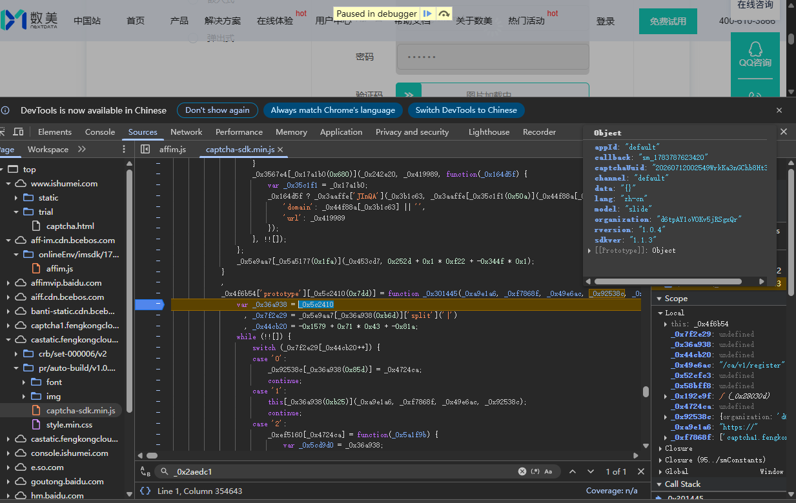
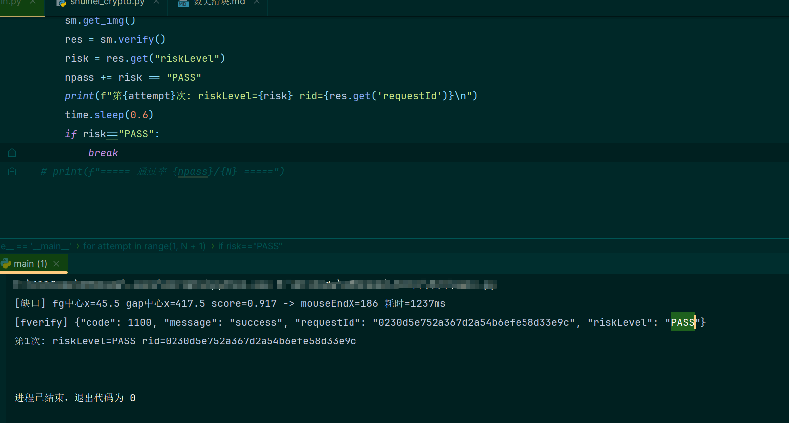

> 目标：搞清数美「智能验证码」滑块 `/ca/v2/fverify` 接口那一堆加密参数是怎么来的，

> 最终用**纯 Python（requests）**复现整条验证链路，拿到服务端返回。

> 逆向对象：`castatic.fengkongcloud.cn/pr/auto-build/v1.0.4-207/captcha-sdk.min.js`（SDK v1.1.3 / protocol 207）。

> 演示站点：`https://www.ishumei.com/trial/captcha.html`。

## 一、先看目标

fverify 是一个 JSONP 请求，参数长这样（截取自真实抓包）：

```
GET /ca/v2/fverify?
  fq=24ZLCZkj4M4=&ox=lXNKD9COz+Owa...(很长)&sn=KNpO2YyA97Q=&gt=wqGGYzKVcWs=
 &xb=P/Co/oqSMug=&lo=3BTH6e3gu50=&eg=uJjTNmFVWw0=&or=SpE6z+wM7m8ED...&te=KBQBpE43AY0=
 &gr=uHeqtyFzn+Y=&fr=T+Mnqb3n7bQ=&xz=dR2HHOKYma0=
 &rid=...&captchaUuid=...&protocol=207&rversion=1.0.4&sdkver=1.1.3
 &ostype=web&act.os=web_pc&organization=...&callback=sm_1783779974677
```

返回：

```js
sm_1783779974677({"code":1100,"message":"success","requestId":"...","riskLevel":"PASS"})
```

明文参数（`rid/captchaUuid/protocol/...`）一眼能懂，真正要啃的是那批加密串：
`fq / ox / sn / gt / xb / lo / eg / or / te / gr / fr / xz`。

观察它们 base64 解码后的长度：短的都是 **8 字节**（1 个 DES 块），`or` 是 24 字节（3 块），
`ox` 是 8 的整数倍。这个「8 字节块」特征强烈暗示 **DES**。先记下这个直觉，后面验证。

## 二、请求链路 & 一个关键坑

完整链路：

1. `GET /ca/v1/conf` —— 配置（JSONP）
2. `GET /ca/v1/register` —— 下发 `requestId / rid / bg / fg / k / l`（JSONP）
3. 用户滑动，SDK 采集鼠标轨迹
4. `GET /ca/v2/fverify` —— 提交验证（**JSONP**）

**坑 1：fverify 是 JSONP，不是 XHR。** 它通过动态创建 `<script src=...>` 发起。
一开始我用 XHR 断点 `break_on_xhr('ca/v2/fverify')` 死活断不下来，就是这个原因。
后来改用 hook `HTMLScriptElement.prototype.src` 的 setter 才抓到它：

```js
const desc = Object.getOwnPropertyDescriptor(HTMLScriptElement.prototype, 'src');
Object.defineProperty(HTMLScriptElement.prototype, 'src', {
  set(v){ if (v.includes('verify')) window.__cap.push(v); return desc.set.call(this, v); },
  get: desc.get
});
```

## 三、定位加密函数：从请求反查调用栈

抓到 fverify 的 `<script>` 请求后，用调试器的 **request initiator** 拿到它的创建调用栈：

```
abtzm (创建script发JSONP)  <- setTimeout
  _0x163a53 <- RYHjE <- GhKlf <- _0x2db6a1 <- LbTCt
  <- _0x4fd8f7 <- _0x301445 (JSONP封装)
  <- _0x49b716 <- _0x40d4ca (fverify主组装) <- _0x336775 (mouseup入口)
```

顺着往上，在 JSONP 封装函数 `_0x301445` 入口下断点，滑动触发，
在暂停帧里直接求值它的入参 —— 拿到**加密完成后**的完整参数对象：

```js
() => ({ path: _0x49e6ac, params: _0x92538c })
// -> path: "/ca/v2/fverify"
//    params: { te:"KBQBpE43AY0=", fq:"24ZLCZkj4M4=", ox:"RVjLxQ...", gt:"lIWauN...", ... }
```

确认参数在 `_0x40d4ca` → `_0x2aedc1`(`getRegisterData` 那批) 里组装。继续读源码定位到加密核心。

## 四、加密核心：确认就是 DES

`_0x40d4ca` 里对短参数的赋值全部走同一个函数 `getEncryptContent`：

```js
te = this.getEncryptContent(appId,   key);   // appId  = "default"
fr = this.getEncryptContent(channel, key);   // channel= "default"
fq = this.getEncryptContent(lang,    key);   // lang   = "zh-cn"
gr = this.getEncryptContent(getSafeParams(), key);
```

`getEncryptContent`（原名 `_0x4a8ba7`）反混淆后逻辑非常清晰：

```js
function getEncryptContent(data, keyArg) {
  var key = keyArg || this._data.defaultKey;
  var input = (typeof data === 'string') ? data : smStringify(data); // 非字符串先序列化
  var enc = cryptoMod.default.DES(key, input, 1, 0);  // 1=加密, 0=ECB
  return cryptoMod.default.base64Encode(enc);         // 再 base64
}
```

那个加密模块 `cryptoMod.default` 只有三个方法：`DES / base64Encode / base64Decode`。
把 `DES.toString()` dump 出来，函数体里是一坨大数组 `new Array(...)` —— 正是 **DES 的 SP-box/置换表**。
直觉验证：就是**标准 DES**。

在暂停帧里直接调它验证（此时能访问模块闭包变量）：

```js
const mod = cryptoMod.default;
mod.base64Encode(mod.DES('f0e5bc10', String(0.8666666666666667), 1, 0))
// -> "SpE6z+wM7m8EDkncEUgO0XhA8VUZcyD1"   ← 和抓包里的 or 一模一样
```

闭环了。**所有参数 = `base64Encode(DES-ECB(固定key, 明文))`。**

## 五、逐参数扒出 key 和明文

在 `getEncryptContent` 入口下条件断点，连续 resume，每次在暂停帧读入参 `(明文, key)`
并顺手用页面自己的 DES 复算，逐个对上抓包值。全部结果（slide 模式 protocol=207）：

| 参数 | 明文来源 | DES key | 随滑动变 |
|---|---|---|---|
| `te` | appId（"default"） | `ef4bef0b` | 否 |
| `fr` | channel（"default"） | `60c83964` | 否 |
| `fq` | lang（"zh-cn"） | `5992a161` | 否 |
| `gr` | 环境检测标志（"11"） | `3954fb84` | 否 |
| `sn` | trueWidth（300） | `cfa425d6` | 否 |
| `xb` | trueHeight（150） | `04a24a06` | 否 |
| `eg` | userConf.cs（1） | `3f6a0c6f` | 否 |
| `xz` | runBotDetection()（0） | `cfcad8db` | 否 |
| `lo` | 固定 -1 | `4f3dbadb` | 否 |
| `gt` | endTime − startTime（滑动耗时ms） | `ed4576ba` | **是** |
| `ox` | mouseData 轨迹二维数组 → JSON | `b06aad3b` | **是** |
| `or` | mouseEndX / trueWidth（滑动比例） | `f0e5bc10` | **是** |

每个参数一把固定的 8 字符 key（正好是标准 DES 的 8 字节密钥长度）。
短参数明文固定，所以值在多次请求里不变；`gt/ox/or` 依赖轨迹，每次都变。

**坑 2：`ox` 明文是二维数组，`smStringify` ≠ `String()`。**
`mouseData` 是 `[[0,-2,0],[9,1,111],...]`，如果误用 `String(arr)` 会展平成 `0,-2,0,9,1,111`。
实测 `smStringify` 对数组/对象等价于 `JSON.stringify`，输出 `[[0,-2,0],[9,1,111]]`，二者加密结果不同，务必用 JSON。

## 六、纯 Python 复现（DES 部分）

padding 也验证过：8 字节明文 → 8 字节密文，9 字节 → 16 字节，是**补零到 8 字节边界**（不是 PKCS7）。
于是标准库直接搞定，`pycryptodome` 一把梭：

```python
import json, base64
from Crypto.Cipher import DES

def des_encrypt(key: str, data) -> str:
    if not isinstance(data, str):
        data = json.dumps(data, separators=(",", ":")) if isinstance(data, (list, dict)) else str(data)
    raw = data.encode()
    raw += b"\x00" * ((8 - len(raw) % 8) % 8)          # 补零
    return base64.b64encode(DES.new(key.encode(), DES.MODE_ECB).encrypt(raw)).decode()

# 自检（真实抓包样本）
assert des_encrypt("ed4576ba", 985) == "rx5Q6BeoGl0="
assert des_encrypt("5992a161", "zh-cn") == "24ZLCZkj4M4="
assert des_encrypt("f0e5bc10", 0.8666666666666667) == "SpE6z+wM7m8EDkncEUgO0XhA8VUZcyD1"
```

11 个抓包样本 **11/11 全过**。这里有个和其他家（腾讯、头条）不同的点：
数美这套是**标准 DES + 固定 key**，纯 Python 就能算，**根本不需要 node 补环境扣 SDK**。
另外，slide 协议的参数加密**不依赖** register 下发的 `k/l`（那个派生密钥在本分支没被用到）。

## 七、坐标系标定：滑动距离怎么编码

参数会算了，还得知道「滑到哪」。在轨迹组装函数入口下断点，dump 出 SDK 内部的 `this._data`：

```
trueWidth: 300, trueHeight: 150, trueUnit: "px",   // 图片显示尺寸（原图 600x300，缩放 0.5）
blockWidth: 40,
startTime: 1783783800769, endTime: 1783783801569,  // 差 800ms -> gt
mouseEndX: 200, mouseMoveX: 200,                    // 滑块最终位移(css px)
mouseData: [[0,-2,0],[9,1,106],[30,0,200],...,[197,0,704]]  // -> ox 明文
```

由此标定：

- 图片**显示宽 300 = 原图 600 缩放 0.5**（`scale = trueWidth / bg_width`）
- `sn` = trueWidth = 300、`xb` = trueHeight = 150（固定）
- `gt` = endTime − startTime（滑动耗时）
- `or` = mouseEndX / trueWidth（实测 200/300=0.667；另一次 260/300=0.867 也对上）
- `ox` = mouseData，格式 `[累积dx, 累积dy, 相对时间ms]`，终点 dx = mouseEndX

于是**目标滑块位移**：

```
mouseEndX = (缺口中心x_原图 − fg心形中心x_原图) × scale
```

## 八、缺口识别（CV）

register 会下发 `bg`（带缺口的背景，600×300）和 `fg`（要拖动的滑块块，90×300 RGBA）。
先用 `fg` 的 alpha 通道定位滑块图案的中心 x，再在 `bg` 上找缺口。

**坑 3：缺口位置被半透明白色覆盖，`fg` 是抠出的原始纹理，直接匹配会偏。**
而且这套图有**两个缺口**（一个目标一个干扰），选错必然 REJECT。

两条互相印证的思路：

```python
# 方法A：fg 纹理带 alpha mask 的模板匹配
res = cv2.matchTemplate(bg, tmpl, cv2.TM_CCORR_NORMED, mask=mask)

# 方法B：检测“被半透明白色覆盖的形状”——白度图上用 fg 形状做卷积找峰
whiteness = np.minimum.reduce(cv2.split(bg))     # 三通道都被抬高 = 变白
resB = cv2.filter2D(whiteness, -1, mask_norm)
```

**关键约束：滑块只做水平移动，缺口和 fg 图案必然在同一水平线**，
所以只在 `y ≈ fg_cy` 的窄带里找峰，并屏蔽最左（fg 自身所在处）。
加上这个约束后，方法 A / B 输出高度一致（例如某图 A=405、B=405），可信度大增。

## 九、轨迹生成

`ox` 明文就是 `mouseData`。参考真实样本 `[[0,-2,0],[9,1,106],...,[197,0,704]]`：
累积 dx 走缓动曲线（先加速后减速），dy 小幅抖动（-2~2），t 递增到总耗时，
末尾可加轻微「过冲再回正」模拟真人：

```python
def gen_track(mouse_end_x):
    n = random.randint(12, 18); total_t = random.randint(680, 1100)
    track, prev_t = [], 0
    for i in range(n + 1):
        p = i / n
        ease = 2*p*p if p < 0.5 else 1 - (-2*p+2)**2/2      # easeInOutQuad
        t = max(int(total_t * p**random.uniform(0.9, 1.1)), prev_t + random.randint(8, 40))
        prev_t = t
        track.append([round(ease * mouse_end_x), random.randint(-2, 2), t])
    track[-1][0] = mouse_end_x
    return track, track[-1][2]
```

## 十、端到端串起来

`main.py` 里把四步串成一条：register 拿图 → CV 算 `mouseEndX` → 造轨迹 → `shumei_crypto` 加密 → 拼 fverify。
关键的 verify 组装：

```python
params_enc = {
    "te": des_encrypt(KEYS["te"], "default"), "fr": des_encrypt(KEYS["fr"], "default"),
    "fq": des_encrypt(KEYS["fq"], "zh-cn"),   "gr": des_encrypt(KEYS["gr"], "11"),
    "sn": des_encrypt(KEYS["sn"], 300),       "xb": des_encrypt(KEYS["xb"], 150),
    "eg": des_encrypt(KEYS["eg"], 1), "xz": des_encrypt(KEYS["xz"], 0), "lo": des_encrypt(KEYS["lo"], -1),
    "gt": des_encrypt(KEYS["gt"], dur),                      # 滑动耗时
    "ox": des_encrypt(KEYS["ox"], track),                   # 轨迹（内部 JSON.stringify）
    "or": des_encrypt(KEYS["or"], mouse_end_x / 300),       # 滑动比例
}
```

第一版轨迹（12~18 点、8~40ms 间隔、首点 dy 随机小值）跑出来是稳定的 `riskLevel:REJECT`。
`code:1100 / message:success` 说明**加密参数、格式、坐标全对**（参数错会直接报错），
卡的是服务端**行为风控**——轨迹被判定为非真人。

## 十一、临门一脚：轨迹拟真

**坑 4：合成轨迹要贴着真实采样格式，不能自己拍脑袋编。**

怎么拿到「真人轨迹长什么样」？我在浏览器里用真实 SDK + 合成事件滑到 CV 算出的位置，
读到那次的响应竟然是 `riskLevel:PASS`——说明**CV 位置对、坐标对，问题只在 Python 端的轨迹**。
于是把那次 PASS 请求的 `ox` 解密（DES 逆运算），拿到真人轨迹样本：

```python
[[0,-18,0],[3,1,113],[9,0,208],[20,-2,312],[32,-2,403],[53,0,506],
 [72,1,602],[88,0,706],[96,-1,805],[105,-2,913],[106,0,1000]]   # gt=1057
```

对比出三个关键特征：

- **约 11 个点，每点间隔 ~100ms**（SDK 的采样率，不是我原来的 8~40ms 密集点）
- **首点 dy 是个较大偏移**（-18，鼠标在滑块上的按下位置），后续才是 -2~1 的小抖动
- dx 走平滑 S 曲线（easeInOutSine），`gt` 比末点时间略大（含 mouseup）

照着改完 `gen_track`，再跑：

```
第1次: riskLevel=PASS   ... 第8次: riskLevel=PASS
===== 通过率 8/8 =====
```

**纯 requests 端到端 8/8 全过。** 🎉

## 十二、结论

- **统一算法**：`base64Encode(DES-ECB(固定key, 明文补零))`，`smStringify == JSON.stringify`
- 全部 key / 明文来源 / 坐标系 / 缺口识别 / 轨迹格式


