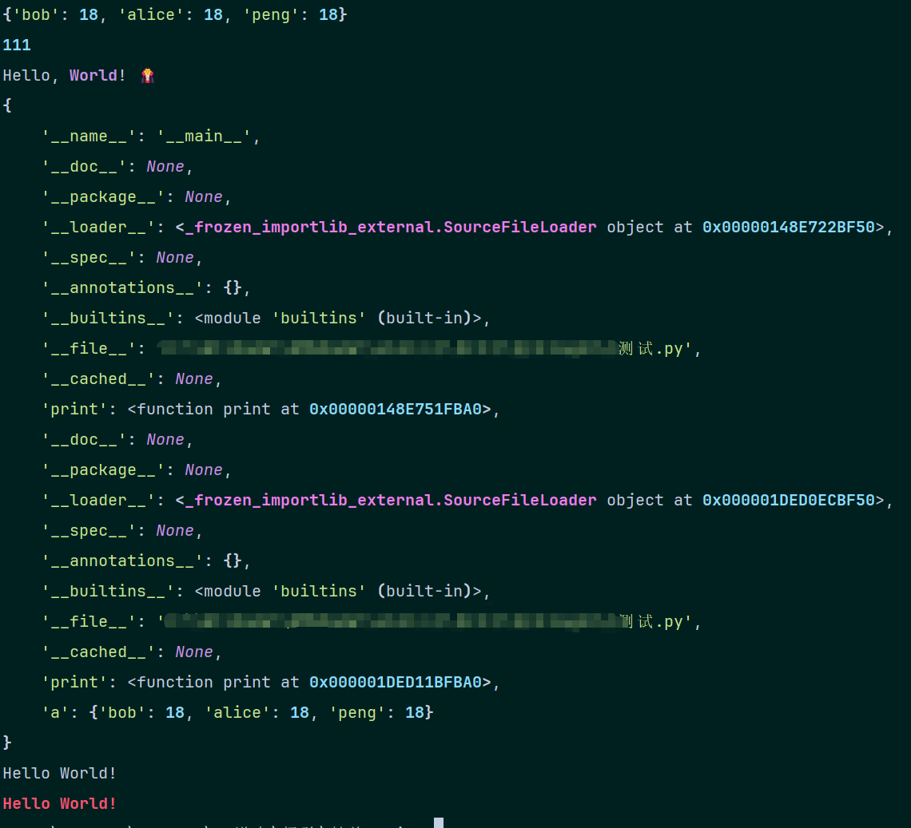
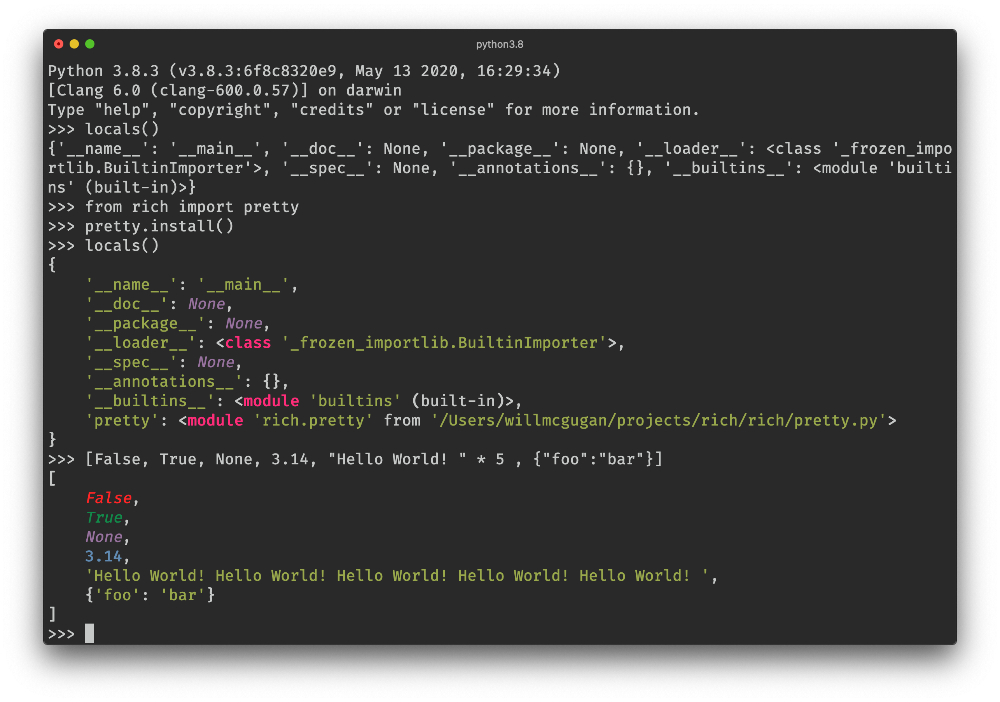
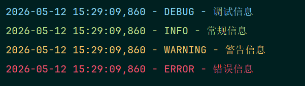

### 一、loguru
    pip install loguru
loguru是用过最多的日志模块。
```python
from loguru import logger

logger.success("1")
logger.info("2")
logger.debug("3")
logger.error("3")
```
输出：

    2026-05-12 14:55:17.491 | SUCCESS  | __main__:<module>:3 - 1
    2026-05-12 14:55:17.491 | INFO     | __main__:<module>:4 - 2
    2026-05-12 14:55:17.491 | DEBUG    | __main__:<module>:5 - 3
    2026-05-12 14:55:17.491 | ERROR    | __main__:<module>:6 - 4
创建文件：

    logger.add("debug.log", format="{time} {level} {message}", level="DEBUG")

### 二、rich
开箱即用地渲染漂亮的表格、进度条、Markdown 文档、语法高亮显示的源代码、回溯信息等等

    pip install Rich
```python
from rich import print

a = dict({"bob":18,"alice":18,"peng":18})
print(a)
print(111)
print("Hello, [bold magenta]World[/bold magenta]!", ":vampire:", locals())
from rich.console import Console
console = Console()
console.print("Hello", "World!")
# Rich 会将文字自动换行以适合终端宽度。
# 添加颜色
console.print("Hello", "World!", style="bold red")
```

可以安装在 Python REPL 中，这样任何数据结构都会被美化打印和高亮显示

from rich.table也能输出表格

### 三、colorlog
colorlog 是一个用于 Python logging 模块的库，能够以彩色方式输出控制台日志，极大提升了日志的可读性。使用方法主要包括安装 pip install colorlog、实例化 ColoredFormatter、设置日志格式（包含颜色代码），并将其添加至 StreamHandler
```python
import logging
import colorlog
def setup_logger():
    # 定义日志格式，使用 %s 包含颜色代码
    log_format = '%(log_color)s%(asctime)s - %(levelname)s - %(message)s'
    # 创建格式化器，设置不同等级的颜色
    formatter = colorlog.ColoredFormatter(
        log_format,
        log_colors={
            'DEBUG': 'cyan',
            'INFO': 'green',
            'WARNING': 'yellow',
            'ERROR': 'red',
            'CRITICAL': 'red,bg_white',
        }
    )
    # 设置 Handler
    handler = colorlog.StreamHandler()
    handler.setFormatter(formatter)

    # 设置 Logger
    logger = colorlog.getLogger(__name__)
    logger.addHandler(handler)
    logger.setLevel(logging.DEBUG)

    return logger

log = setup_logger()
log.debug("调试信息")
log.info("常规信息")
log.warning("警告信息")
log.error("错误信息")
```


### 四、Quick-Logger	
...