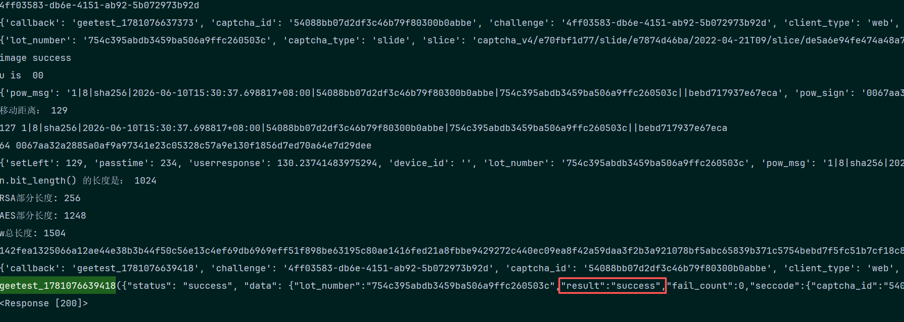

    网页 demo：https://github.com/geetestweb/gt4-public-client-demo
    
    官方 Demo1：https://gt4.geetest.com/ (opens new window)
    
    官方 Demo2：https://www.geetest.com/adaptive-captcha-demo(opens new window)
    
    官方 Demo3：https://gt4.geetest.com/demov4/index-zh.html
    
    https://www.gate.com/zh/login
#
    setLeft = 滑动距离
    passtime = 通过时间
    userresponse = 固定计算：滑动距离 / 1.0059466666666665 + 2
    lot_number = 服务返回lot_number
    pow_msg = f"1|8|sha256|{timestamp}|{captcha_id}|{lot_number}||{随机16进制字符串}"
    pow_sign = sha256 加密

总共两个接口：

GET：https://gcaptcha4.geetest.com/load

| 字段  | 说明       | 类型  | 是否必填	  | 备注                                     |
|---|----------|-----|---|----------------------------------------|
|  captcha_id | 类似版本号信息	 | str | 是  | 写死或 adaptive-captcha-demo.js 取值都行      |
| challenge  | uuid     | str |  是 | 类似4ff03583-db6e-4151-ab92-5b072973b92d |
|  client_type |   客户端类型	       | str |  是 |          写死，值为 web                              |
|  risk_type |      验证类型	    | str | 是  |                  写死，值为 slide                      |
|  lang |    语言	      | str | 是  |         写死，值为 zh                               |

    返回lot_number、process_token、payload、背景和缺口等

GET：https://gcaptcha4.geetest.com/verify

| 字段  | 说明          | 类型  | 是否必填	  | 备注          |
|---|-------------|-----|---|-------------|
|  captcha_id | 类似版本号信息	    | str | 是  | 写死          |
| challenge  | uuid        | str |  是 | 生成          |
|  lot_number | 批号	    | str |  是 | 服务器返回       |
|  risk_type | 验证类型	       | str | 是  | 值为 slide    |
|  pt | 不重要	        | str | 是  | 值为 1        |
|  payload | load返回的	 | str | 是  | 服务器返回       |
|  w | 轨迹、环境处理	    | str | 是  | AES-CBC、RSA |
|  process_token | load返回的	    | str | 是  | 服务器返回       |

样本数据如下：
```json
{
    "setLeft": 231,
    "passtime": 208,
    "userresponse": "231.63444052699947",
    "device_id": "",
    "lot_number": "4812761d94e54e2bbca4fecdbf7eda3c",
    "pow_msg": "1|8|sha256|2026-06-03T19:12:43.451005+08:00|54088bb07d2df3c46b79f80300b0abbe|4812761d94e54e2bbca4fecdbf7eda3c||12720cc6752d708b",
    "pow_sign": "00a09c09e7ae210733a1fcf4ee09509e78dd7ea45d83ce2ab6ed5b233d938f64",
    "geetest": "captcha",
    "lang": "zh",
    "ep": "123",
    "biht": "1426265548",
    "gee_guard": {
        "roe": {
            "aup": "3",
            "sep": "3",
            "egp": "3",
            "auh": "3",
            "rew": "3",
            "snh": "3",
            "res": "3",
            "cdc": "3"
        }
    },
    "ZAhG": "MwHu",
    "ca4e": {
        "bca4": {
            "dbf7eda3": "e54e2b"
        }
    },
    "em": {
        "ph": 0,
        "cp": 0,
        "ek": "11",
        "wd": 1,
        "nt": 0,
        "si": 0,
        "sc": 0
    }
}
```

然后经过AES-CBC和RSA处理，
```python
data = {"setLeft": 1, "passtime":234 , ...}
print(data)
plaintext = json.dumps(data, separators=(',', ':'), ensure_ascii=False)

# 2. AES key 生成
key_hex = ''.join(generate_h() for _ in range(2))  # 32 hex字符 = 16 bytes
aes_key = binascii.unhexlify(key_hex)

# 3. AES-CBC 加密
iv = b"0000000000000000"  # 字符串'0'，不是零字节
cipher_aes = AES.new(aes_key, AES.MODE_CBC, iv)
ciphertext_aes = cipher_aes.encrypt(pad(plaintext.encode('utf-8'), AES.block_size))
# 4. RSA 公钥构建
modulus_hex = "00C1E3934D1614465B33053E7F48EE4EC87B14B95EF88947713D25EECBFF7E74C7977D02DC1D9451F79DD5D1C10C29ACB6A9B4D6FB7D0A0279B6719E1772565F09AF627715919221AEF91899CAE08C0D686D748B20A3603BE2318CA6BC2B59706592A9219D0BF05C9F65023A21D2330807252AE0066D59CEEFA5F2748EA80BAB81"
n = int(modulus_hex, 16)
print("n.bit_length() 的长度是：",n.bit_length())  # 实际是多少 bit？
e = 65537
rsa_key = RSA.construct((int(modulus_hex, 16), e))
cipher_rsa = PKCS1_v1_5.new(rsa_key)

while True:
    rsa_encrypted_key = cipher_rsa.encrypt(aes_key)
    if len(binascii.hexlify(rsa_encrypted_key).decode()) == 256:
        break
# 6. 拼接最终 w
w = binascii.hexlify(ciphertext_aes).decode() + binascii.hexlify(rsa_encrypted_key).decode()

```


