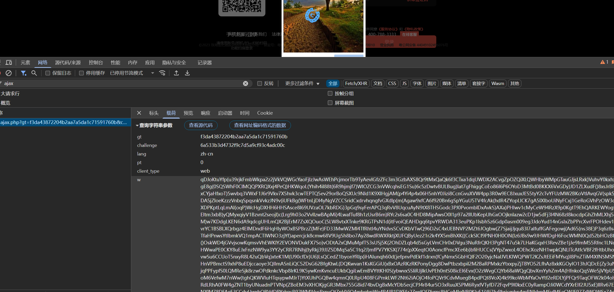
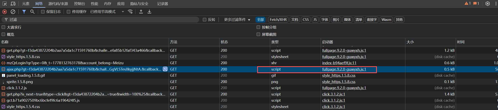
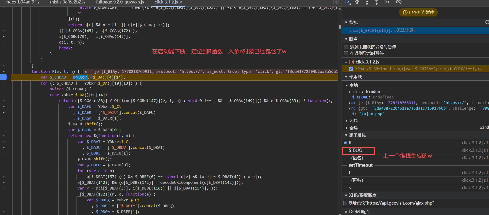
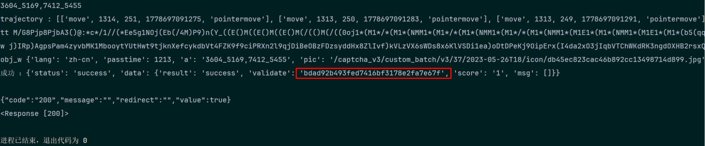

### 第一个 w 值
    略
    i[$_CFFJV(1198)] = p[$_CFFIf(1196)](c[$_CFFIf(92)](r, i[$_CFFJV(1144)]()));


### 第二个 w 值
    https://api.geevisit.com/ajax.php


    在请求调用堆栈下断点，return e[$_BGHEa(439)][$_BGHDX(661)](this[$_BGHEa(439)]),
    断点e[$_BGHEa(439)][$_BGHDX(661)]不是send,而是 name:"appendChild"表明信息已经生成了，
    下XHR断点ajax.php，断不下来,因为这个链接请求是通过script请求的


    而且this[$_BGHEa(439)] 值是 <script charset="UTF-8" src="https://api.geevisit.com/ajax.php?gt=f3da43872204b2aa7a5da1c71591760b&amp;challenge=539514138642f641204ad6641d5369e8&amp;lang=zh-cn&amp;pt=0&amp;client_type=web&amp;w=mNbmVNmz....&amp;callback=geetest_1778133004794"></script>也说明这点。
    this是方法本身，"\u0024\u005f\u0046\u0048\u006f"--->'$_FHo'
    上一个匿名堆栈调用的'$_FHo'，
    最后定位到生成w2的位置：i[$_CFFJV(1198)] = p[$_CFFIf(1196)](c[$_CFFIf(92)](r, i[$_CFFJV(1144)]()))

    除了个别参数，和滑动一模一样，定位fp和lp轨迹的位置
```javascript
for (var a = [[$_CFEDd(244), o[$_CFEDd(244)] || $_CFEET(235)], [$_CFEDd(363), $_CFEET(1166)], [$_CFEET(1168), function(e, t, n) {
                    var $_CFEIz = Vwtrj.$_CV
                      , $_CFEHt = ['$_CFFBS'].concat($_CFEIz)
                      , $_CFEJE = $_CFEHt[1];
                    $_CFEHt.shift();
                    var $_CFFAF = $_CFEHt[0];
                    if (!t || !n)
                        return e;
                    var r, o = 0, i = e, s = t[0], a = t[2], _ = t[4];
                    while (r = n[$_CFEIz(226)](o, 2)) {
                        o += 2;
                        var c = parseInt(r, 16)
                          , l = String[$_CFEJE(456)](c)
                          , u = (s * c * c + a * c + _) % e[$_CFEJE(71)];
                        i = i[$_CFEIz(226)](0, u) + l + i[$_CFEJE(226)](u);
                    }
                    return i;
                }(e, o[$_CFEDd(844)], o[$_CFEET(520)]) || -1], [$_CFEDd(1141), r || -1], [$_CFEDd(520), H(p[$_CFEDd(911)](t))], [$_CFEET(1164), H(p[$_CFEDd(911)](n))], [$_CFEDd(1159), H(n)], [$_CFEDd(1174), H(i[$_CFEDd(1181)])], [$_CFEET(1197), i[$_CFEDd(1197)] || -1], [$_CFEDd(1172), i[$_CFEET(1172)] || -1], [$_CFEDd(1171), i[$_CFEDd(1129)]() || -1], [$_CFEET(1155), s || -1], [$_CFEDd(1104), H(o[$_CFEDd(379)] + o[$_CFEET(315)] + s)]], _ = 0; _ < a[$_CFEDd(71)]; _++)
                    i[$_CFEDd(1150)] += $_CFEDd(727) + a[_][0] + $_CFEDd(1125) + de[$_CFEET(457)](a[_][1]) + $_CFEDd(712);
```
    循环产生的i-->r-->加密数据如下：
```json
{
    "lang": "zh-cn",
    "type": "fullpage",
    "tt": "M7d8Pjp8Pjp8Pjp8N)1E1N21p2/*33-*M5(((@((n555-9(n5,(P(,bb9,e@5B-nb((c(((8(,b5(JI9(C9B:e(5b((:):((.A(-1JaNckj-1K0NjM9K)*0O))jK*O0O))jKCQXK0Nj/1MEK0MENjK)*0NcLhM9OBK0MEO))jK)*/NPNUK)*1-0O))c)j-1K)Pi2:LUIpK)*1-0O))jK0NVG)*0-0NVokGCM9O))jK0O)Nj/1K0M9NVG,h)Nj2qGCOgC:Pcih-*D4E:PU-0O))jK0M9NU-1K0NjK).:JjRNocLTPUK)MK2GFjRLAU*cY(q(b(((,(BBBB:((DA(,(55(5,b,(.BAA(,5(,(n((8(,,,b(-B:A(,5beD@b9-)(E7(b90*(P-n/*9c:A6D9N3)(AW:991:AM-)f@1:9Q.cq:K5G.S9.I-D1)*SJ,EL)(P1?b9-BM9SVJPME-N3)(E-(-),)(NOY/cMbA2,QL0X.:7qJQ/*M9ME.0GRO)NAB1-.M96,-d-)M9*)(9-)3)(9/)M)*)(E/(-PD4.80)1D1X.)A9Nj6.ME-5-),)(9/,M)N()qqn((()qqM(Lqqj((((((,M2g(((55b((8(bb(()-BBB9(be(ee5n(-9(5nb5n8(bb5((-(((bneM(@c19-)1fM95PM91j-*9,-N1)M93)(?-U7(-1/,IiCilKQ:Q:fC-*-@0)jL4NE?ajGI-,1E-(/)(,9j-*/)(1-)*)(?Mb-11)M95TGX.7-DeSVE--3*(5-),)(9-5-)4)(I?*55-*bb-),*(9/*M)(E5(-RFmOc)V_B:N65-)(E3(M9-1?)3)(910M(((((qqj(()nqqqb",
    "light": "DIV_0|DIV_0|SPAN_1|INPUT_2|DIV_3",
    "s": "c7c3e21112fe4f741921cb3e4ff9f7cb",
    "h": "321f9af1e098233dbd03f250fd2b5e21",
    "hh": "39bd9cad9e425c3a8f51610fd506e3b3",
    "hi": "09eb21b3ae9542a9bc1e8b63b3d9a467",
    "vip_order": -1,
    "ct": -1,
    "ep": {
        "v": "9.2.0-guwyxh",
        "te": false,
        "$_BBn": true,
        "ven": "Google Inc. (Google)",
        "ren": "ANGLE (Google, Vulkan 1.3.0 (SwiftShader Device (Subzero) (0x0000C0DE)), SwiftShader driver)",
        "fp": [
            "move",
            1491,
            79,
            1778141612446,
            "pointermove"
        ],
        "lp": [
            "up",
            1630,
            132,
            1778141616990,
            "pointerup"
        ],
        "em": {
            "ph": 0,
            "cp": 0,
            "ek": "11",
            "wd": 1,
            "nt": 0,
            "si": 0,
            "sc": 0
        },
        "tm": {
            "a": 1778141609837,
            "b": 1778141609964,
            "c": 1778141609964,
            "d": 0,
            "e": 0,
            "f": 1778141609838,
            "g": 1778141609838,
            "h": 1778141609838,
            "i": 1778141609840,
            "j": 1778141609877,
            "k": 1778141609840,
            "l": 1778141609877,
            "m": 1778141609960,
            "n": 1778141609961,
            "o": 1778141609966,
            "p": 1778141609976,
            "q": 1778141609984,
            "r": 1778141609984,
            "s": 1778141609984,
            "t": 1778141609984,
            "u": 1778141609985
        },
        "dnf": "dnf",
        "by": 2
    },
    "passtime": 8670,
    "rp": "f3eb17de64560e5541d0c92e336d2669",
    "captcha_token": "112439067",
    "tsfq": "xovrayel"
}
```
    轨迹大数组e = i[$_CFEDd(1070)][$_CFEET(1076)]()计算是tt
    这个轨迹是点选验证弹出之前的校验检测。
    /ajax.php参数处理完毕，成功拿到{'status': 'success', 'data': {'result': 'click'}}

    请求get.php的到点选图片url:{'status': 'success', 'data': {'theme': 'silver', 'theme_version': '1.5.4', 'static_servers': ['static.geetest.com/', 'static.geevisit.com/'], 'api_server': 'api.geevisit.com', 'logo': True, 'feedback': 'https://www.geetest.com/contact#report', 'spec': '1*1', 'sign': '', 'pic': '/captcha_v3/custom_batch/v3/37/2023-05-26T18/icon/4a5a2b82258e4458ab678aa2f15cfcde.jpg', 'pic_type': 'icon', 'num': 0, 'image_servers': ['static.geetest.com/', 'dn-staticdown.qbox.me/'], 'resource_servers': ['static.geetest.com/', 'static.geevisit.com/'], 'c': [12, 58, 98, 36, 43, 95, 62, 15, 12], 's': '48755840', 'i18n_labels': {'atip': '请按_语序_依次_点击下图文字:', 'cancel': '取消', 'close': '关闭验证', 'commit': '确认', 'fail': '验证失败 请按提示重新操作', 'fail_short': '验证失败', 'feedback': '帮助反馈', 'forbidden': '验证出小差啦 请3秒后重试', 'loading': '加载中...', 'maze': '请_点击_图片以_移动_小黄球，追上小旗杆', 'read_reversed': False, 'refresh': '刷新验证', 'small_tip': '请选中下图中所有的：', 'success': '验证成功 您的速度已超过 %s%% 的用户', 'success_short': '验证成功', 'tip': '请在下图_依次_点击：', 'voice': '视觉障碍'}, 'gct_path': '/static/js/gct.b71a9027509bc6bcfef9fc6a196424f5.js'}}

### 第三个w值
    
    也在这个位置，和处理w1一样
    "\u0067\u0074": r[$_CADAp(140)],
    "\u0063\u0068\u0061\u006c\u006c\u0065\u006e\u0067\u0065": r[$_CADAp(148)],
    "\u006c\u0061\u006e\u0067": o[$_CADBN(172)],
    "\u0070\u0074": n[$_CADBN(643)],
    "\u0063\u006c\u0069\u0065\u006e\u0074\u005f\u0074\u0079\u0070\u0065": n[$_CADAp(612)],
    "\u0077": p + u 


    
    "\u0077" 就是w，主要处理p+u
    u是随机十六位字符
        u：const te_fun = () => Array(4).fill().map(()=>(65536*(1+Math.random())|0).toString(16).slice(1)).join('');

```json
{
    "lang": "zh-cn",
    "passtime": 1111,
    "a": "7040_4086,5343_3923,4136_6631",
    "pic": "/captcha_v3/custom_batch/v3/37/2023-05-26T18/icon/358a9edfd0694f35abc4124d9246e0bc.jpg",
    "tt": "M5?8Pjp8Pjp3b)35-*Pb-Up8MN9U*O5(-9,b(b,,b@)))--(AB(5(((q,5,8))9((().n(n6Bb((nf,(55::*))jLin9GS*G8O)Nj-1K0RU-0NjK)*/O))j-1K1Jij-1Ldii2TNPnJ.iLjqNIZnM9OG7Nj-1GDRUoTO))j-1M9K0MENU11KBMENj-1M9K00b.)0TNjK0NjK0CUCNl))j-1K0O))j-1K1-0-)o*2U-0NjK0Nj-1M9K1-84EK1-0NjK)*7O),i-1-,j-*(Pj85((b5n,((e(enle).)((e(b(,((((55((((,(((-(bb(5(8C3Ej/(b9-13)1@EhK)*3Sj-3O))j-.MjM96?5B@)(NME(9/)()M93/(51)4)(ib97Q-i.N7L-5?EAY/-0)(d5Y-,-c5?/)M)1f6TC.9?M9(9b9-f6,2,9919/)M)C2XGpH.GBdME(Mb9-b1*,)(9-),)(E/(E((80qqqqqqqqn((Lb-,/Fj(/LpEE(/)qS(((E(E(/)M()M0TTM(()S(((/E/(/3m/,),(M)91)MM2*(Q7,)0MMCq*)j5.MM5*(,(M(NMM11E-/,(M195,(M/4(j1-7*)*c5NbRTMMjW?)MMNONU7**-FE1/:QES(bE(1*/*(b5(5,(91*I**b17J@,Sd*9b1(5,*6@B,nd3I,(R(b2*A1(M2(5*(6qPqqqqqj(((((",
    "ep": {
        "ca": [
            {
                "x": 1257,
                "y": 97,
                "t": 1,
                "dt": 321
            },
            {
                "x": 1356,
                "y": 350,
                "t": 3,
                "dt": 999
            },
            {
                "x": 1224,
                "y": 254,
                "t": 1,
                "dt": 118043
            },
            {
                "x": 1312,
                "y": 146,
                "t": 1,
                "dt": 248
            },
            {
                "x": 1224,
                "y": 137,
                "t": 1,
                "dt": 2700
            },
            {
                "x": 1379,
                "y": 349,
                "t": 3,
                "dt": 712
            },
            {
                "x": 1335,
                "y": 150,
                "t": 1,
                "dt": 190850
            },
            {
                "x": 1283,
                "y": 145,
                "t": 1,
                "dt": 314
            },
            {
                "x": 1246,
                "y": 228,
                "t": 1,
                "dt": 262
            },
            {
                "x": 1365,
                "y": 345,
                "t": 3,
                "dt": 534
            }
        ],
        "v": "3.1.2",
        "$_FG": false,
        "me": true,
        "tm": {
        }
    },
    "h9s9": "1816378497",
    "rp": "373b7406fbe0b4a527d9c60c4983569c"
}
```
    分析几组数据，发现a是点击的点信息，ep看起来像是某个屏幕采集坐标数据
    
```js
// 直接读这个元素的位置属性
let mark = document.querySelector('.geetest_big_mark')
console.log(mark.getBoundingClientRect())
console.log(mark.style)  // 看有没有 transform/left/top
console.log(mark.style.left) //55.064% * 100 = 5506
console.log(mark.style.top) //57.5004%
console.log(mark.style.transform)
```
    原来啊，这个a，表示的图片文字点击位置占图的百分比：55.064% * 100 = 5506
    
    tt是生产的数组轨迹经过压缩转换得来的,轨迹像这样：
```js
let img_e =[
    [
        "move",
        1794,
        534,
        1778694076780,
        "pointermove"
    ],
    [
        "move",
        1747,
        512,
        1778694076788,
        "pointermove"
    ],
    [
        "move",
        1713,
        496,
        1778694076795,
        "pointermove"
    ],]
```
    最后附上成功截图：

