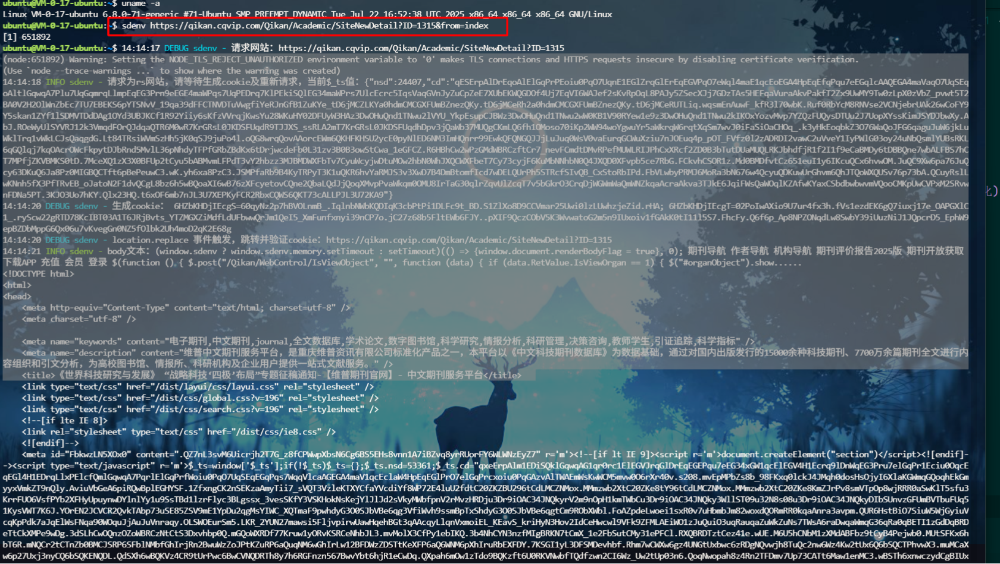

#### 信息：
    
    网址：http://sthjt.hubei.gov.cn/site/sthjt/search.html | https://qikan.cqvip.com/Qikan/Journal/JournalGuid?from=Qikan_Search_Index
    药监局NMPA ：https://www.nmpa.gov.cn/yaowen/ypjgyw/index.html    
    验证类型：cookie 
    特征：第一次访问接口 → 412 status 或者 202 status(和版本有关), 返回挑战页，执行 JSVM、反调试，生成动态cookie
    了解到drissionpage等自动化工具有几率被检测到（没测过）
    文章分析：https://juejin.cn/post/7610966377898360872
### 一、debugger

    无限 debugger + JSVM 组合
    在事件监听器断点-脚本 or AntiDebug Breaker
```javascript
let _constructor = constructor;

Function.prototype.constructor = function(s) {
    if (s == "debugger") {
        console.log(s);
        return null;
    }
    return _constructor(s);
}


//去除无限 debugger
Function.prototype.__constructor_back = Function.prototype.constructor;
Function.prototype.constructor = function() {
    if (arguments && typeof arguments[0] === 'string') {
        //alert("new function: " + arguments[0]);
        if ("debugger" === arguments[0]) {
            //arguments[0] = "console.log(\"anti debugger\");";
            //arguments[0] = "";
            return;
        }
    }
    return Function.prototype.__constructor_back.apply(this, arguments);
};


let _Function = Function;
Function = function(s) {
    if (s == "debugger") {
        console.log(s);
        return null;
    }
    return _Function(s);
}
```
### 二、cookie值

    瑞数3、4代是以S和T结尾的两个cookie，其中以S结尾的是第一次请求返回（412|202）
    T结尾的是js生成动态变化的，T、S前面一般会跟着80或443数字，Cookie值第一个数字是瑞数版本。
    瑞数5、6代也有以S和T结尾的两个Cookie，但有些特殊的5代瑞数也有以O和P结尾的，
    同样的，以O结尾的是第一次的412请求返回的，以P结尾的是由JS生成的，Cookie值第一个数字同样为瑞数的版本。
    
    T 是由 S 种子 + 环境指纹 + 时间戳 算出来的，它和你这次请求的上下文是绑定的

### 三、VM入口

    VM-->Virtual Machine虚拟机，浏览器生成和执行的虚拟机脚本环境中的临时脚本，
    比如说，当你在调试一个网页时，如果在某些动态生成并执行的JS代码上设定了断点，Chrome调试器会在一个以"VM"开头的文件中显示这些代码，例如"VM111.js”。这个“VM"文件的存在只是为了调试目的，它并不存在于服务器端，也不会被存储在本地，而是存在于浏览器内存中。
    一般情况下，这类文件的出现是因为浏览器对JavaScript代码的处理方式，如动态编译或者JavaScript堆栈跟踪。通过eval函数或者new Function方法，Chrome浏览器会创建一个"VM"文件来展示这段临时执行的代码

    因为是VM动态的，先启用本地替换,定位入口_$f8 = _$dx.call(_$eV, _$_9);

### 流程分析

    main0.py	主程序:请求 412 → 抓挑战 → 调 node 算 cookie → 带 cookie 二次请求(已验证 412→200)
    run.js	node 运行器:require 补环境四件套、执行触发器、输出完整 cookie
    01env.js	手写补环境(含 cookie jar、getElementById 返回数据 meta 等关键修复)——核心,不会被覆盖
    00content.js / 02ts.js / 03auto.js / 04trigger.js	每次跑 main0.py 时从响应自动重写,无需手动维护

    main0.py + 01env.js 那一套,职责是过瑞数、生成有效 cookie、拿到 200——这件事已经做到了(状态码 200 就是证明)
    错误分析1：
        连"伪装到 TLS 指纹级别"的 curl_cffi 都拿不到,说明服务器是靠真实浏览器运行环境(跑 JS、navigator.webdriver=false、非自动化)来决定给不给内容的。requests 永远不跑 JS、也提供不了浏览器运行时环境,所以无论怎么改 main0.py/01env.js,这个 URL 都返回空。
    
    错误分析2（正确做法？）：
        
        想用 requests 这条路拿这个 URL 的内容 → 做不到(不是改代码能解决的)。
        想拿到内容 → 用 cqvip_fetch.py(驱动真实浏览器内核 + 去自动化特征)。已验证能拿到完整 146KB 正文。
    纯 requests 无法自举这些 cookie(瑞数 S+T 只给你 200 空壳,不再下发别的)。
    用浏览器破壳一次拿到整套 cookie,之后 requests 跨 ID 无限复用(已验证)。
⭐有时候网站会空白？必须开无痕才能正常访问，如：https://www.nmpa.gov.cn/yaowen/ypjgyw/index.html
是因为瑞数收集了很多浏览器的特征信息，导致浏览器拿不到信息的吗？

### 通杀方案

    项目地址：https://github.com/pysunday/sdenv
    全局安装sdenv: npm i sdenv -g
