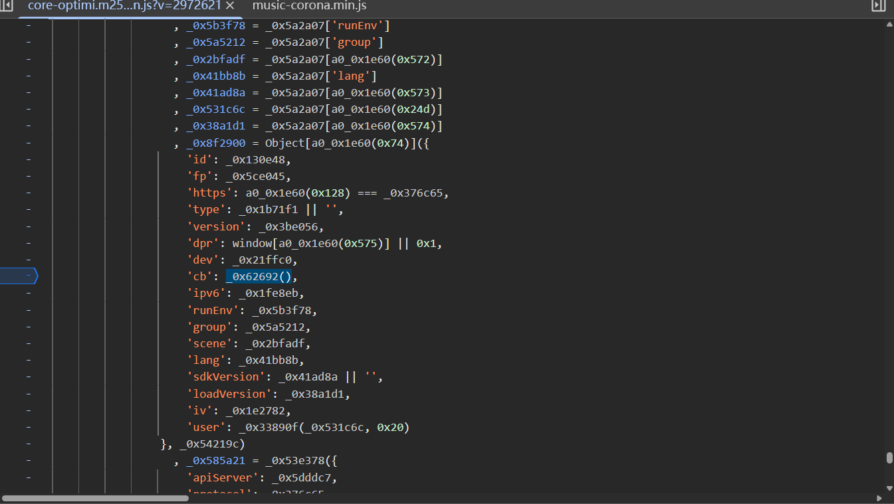

> 目标站点：`https://dun.163.com/trial/jigsaw`（拼图滑块试用页）
> 
> 目标：纯 Python + Node 补环境，走通 `get` → `check` 两个接口，拿到 `result:true` 的 `validate` 值。
> 
> 涉及文件：`01_env.js`（环境）、`02_webpack.js`（抠出来的核心 SDK）、`03_get_cb.js`（生成 cb）、`04_chenck.js`（生成 check 的 data）、`main.py`（主流程）。

---

## 一、整体流程梳理

易盾拼图滑块一次校验只有两个请求：

| 步骤 | 接口 | 作用 | 关键参数 |
| --- | --- | --- | --- |
| ① 取图 | `GET https://c.dun.163.com/api/v3/get` | 拿到 `token`、背景图 `bg`、缺口图 `front` | `cb` |
| ② 校验 | `GET https://c.dun.163.com/api/v3/check` | 提交滑动轨迹，换取 `validate` | `data`、`cb` |

两个接口都带一个 `cb` 参数，`check` 额外有一个加密的 `data`。两者都是 JSONP，响应形如：

```text
__JSONP_zx7y879_47({"data":{"result":true,"zoneId":"CN31","token":"...","validate":"8gxMg..."},"error":0,"msg":"ok"});
```

所以整套逆向的核心就落在三件事上：

1. **`cb`**：补环境跑 SDK 里的 `_0x62692()`；
2. **缺口距离**：OpenCV 模板匹配识别；
3. **`data`**：根据距离构造轨迹，走 SDK 的 `onMouseUp` 逻辑加密。

---

## 二、第一步：get 接口取图 & 生成 cb

`get` 接口参数很多，但绝大多数是**可固定**的会话常量（`zoneId / dt / irToken / id / fp`），真正需要动态生成的是 `cb`：

```python
{
    "referer": "https://dun.163.com/trial/jigsaw",
    "zoneId": "zoneId",        # 可固定
    "dt": "dt",                # 可固定
    "irToken": "irToken",      # 可固定
    "id": "id_",               # 可固定
    "fp": "fp",                # 可固定
    "https": "true",
    "type": "2",
    "version": "2.28.5",
    "dpr": "1",
    "dev": "1",
    "cb": "W/ADW8Gqo...NLpA2hZq7",   # ← 动态生成
    "ipv6": "false",
    "runEnv": "10",
    "lang": "zh-CN",
    "loadVersion": "2.5.4",
    "iv": "4",
    "width": "320",
    "audio": "false",
    "sizeType": "10",
    "smsVersion": "v3",
    "token": "490d76c...",     # 可固定 / 可不带
    "callback": "__JSONP_z6fr74a_11"
}
```

### 定位 cb 的生成

在 `core-optimi.m25b40.v2.28.5.min.js?v=...` 里下断点，跟到生成 `cb` 的入口函数 `ƒ _0x62692()`：



代码是混淆的，处理方式很直接 —— **整体扣代码**：

1. 把整个 `core-optimi` 文件复制成 `02_webpack.js`；
2. 在文件末尾把需要的函数挂到 `window` 上导出，例如 `window._0x62692 = _0x62692;`；
3. 在 `01_env.js` 里补浏览器环境（`window / document / navigator / location …`）；
4. `03_get_cb.js` 负责调用：

```javascript
require("./01_env")
require("./02_webpack")

function get_cb() {
    return window._0x62692()
}

console.log(get_cb())
```

**补环境的核心思路：缺啥补啥。** 报错提示访问了哪个属性/方法，就在 `01_env.js` 里补对应的桩，直到不报错、稳定吐出 `cb`。

`01_env.js` 里有两个值得注意的细节：

- **反「反篡改」**：SDK 会检测被 hook 的函数 `toString` 是否还是 `[native code]`。所以把 `Function.prototype.toString` 也 hook 掉，让被桩的函数伪装成原生：

  ```javascript
  var _ts = Function.prototype.toString;
  var fake = new WeakSet();
  var hooked = function () {
      if (fake.has(this)) return "function " + (this.name || "") + "() { [native code] }";
      return _ts.call(this);
  };
  fake.add(hooked);
  Function.prototype.toString = hooked;
  globalThis.__nat = function (fn) { try { fake.add(fn); } catch (e) {} return fn; };
  ```

- **标准 API 探测**：`window.innerWidth / outerWidth`、`document.createElement('div')` 等属性缺失会被判定为非真实浏览器，需要一并补齐。

Python 侧通过子进程调用 Node 拿结果：

```python
def get_cb():
    """node 补环境跑"""
    PROJ = os.path.dirname(os.path.abspath(__file__))
    p = subprocess.run(["node", "03_get_cb.js", os.path.join(PROJ, "03_get_cb.js")],
                       cwd=PROJ, encoding='utf-8', capture_output=True, text=True)
    if p.returncode != 0:
        raise RuntimeError("node 03_get_cb.js 失败: " + p.stderr[-500:])
    return str(p.stdout).split("\n")[-2]
```

拿到响应后解析 JSONP，取出 `token / bg / front`，并把两张图落地：

```python
result = extract_jsonp(response.text)
self.token = result["data"]["token"]
self.bg    = result["data"]["bg"][0]
self.front = result["data"]["front"][0]
```

---

## 三、第二步：OpenCV 识别缺口距离

背景图 `bg.png` 尺寸 `320×160`，缺口图 `target.png` 为 `60×158` 的整条竖向拼图块。用 Canny 边缘 + 模板匹配求缺口横坐标：

```python
def get_verify_bt_opencv(background, target):
    bg_img = cv2.imread(background)
    tp_img = cv2.imread(target)

    bg_edge = cv2.Canny(bg_img, 100, 200)
    tp_edge = cv2.Canny(tp_img, 100, 200)

    bg_pic = cv2.cvtColor(bg_edge, cv2.COLOR_GRAY2RGB)
    tp_pic = cv2.cvtColor(tp_edge, cv2.COLOR_GRAY2RGB)

    res = cv2.matchTemplate(bg_pic, tp_pic, cv2.TM_CCOEFF_NORMED)
    min_val, max_val, min_loc, max_loc = cv2.minMaxLoc(res)
    return max_loc[0]   # 缺口左边缘 x，即拼图块要滑到的位置
```

因为背景图宽度 = 显示面板宽度 = **320px**，`max_loc[0]` 直接就是拼图块要落到的 CSS 像素位置，无需再做缩放，后面轨迹终点和 `p` 参数都基于它。

---

## 四、第三步：逆向 check 接口的 data

`check` 接口的核心是加密的 `data` 字段：


### 4.1 data 的五段结构

在同一个 `core-optimi` 文件里定位到滑块 `onMouseUp`（对应 `02_webpack.js` 约 4859 行），`data` 由 5 个字段拼成：

```javascript
'data': JSON.stringify({
    'd':   _0xa8a0c6(_0x4a4a62.join(':')),                                  // 轨迹点密文，sample 后 ":" 连接
    'm':   '',                                                              // 拼图恒空
    'p':   _0xa8a0c6(_0x564a9f(token, jigsawLeft / this.width * 100 + '')), // 答案距离（百分比）
    'f':   _0xa8a0c6(_0x564a9f(token, _0x4d98f2.join(','))),                // 轨迹去重指纹
    'ext': _0xa8a0c6(_0x564a9f(token, mouseDownCounts + ',' + traceData.length))
})
```

对应到三个加密原语（都在文件上方 `var` 定义，已挂到 window）：

| 别名 | 作用 |
| --- | --- |
| `_0x3855dc`（`_0x564a9f`） | `encrypt(token, str)`，token 相关的对称加密 |
| `_0x3ebd00`（`_0xa8a0c6`） | 外层编码（自定义 base64 变体） |
| `_0x6e07ce`（`_0x318cde`） | 轨迹去重数组的再编码 |
| `sample` / `unique2DArray` | 工具函数：等距采样、按某列去重 |

### 4.2 轨迹点格式（关键）

一开始在 `onMouseUp` 里看到的 `_0x4a4a62` 是**密文数组**，显示乱码：

```json
["ieaggiN/PEi3", "/cjux/IkvIEP", "/ciuxOI+rXEP", "...", "/cq1giivr4vnUAr3"]
```

不要被它迷惑。往上追 `onMouseMove`（`02_webpack.js` 约 4822 行），每次移动 push 进 `this[0x2d5]` 的才是**真实四元数组**，这才是我们要构造的轨迹：

```javascript
// 02_webpack.js:4822  onMouseMove
var _0x1d0d76 = [
    Math.round(drag.dragX < 0 ? 0 : drag.dragX),   // x : 累计拖动 clientX - startX
    Math.round(clientY - startY),                   // y : 竖直偏移
    now() - beginTime,                              // t : 相对 beginTime 的毫秒
    e.isTrusted == null ? 0 : (e.isTrusted ? 1 : 2) // state : 可信标志，真人=1
];
this.rawTraceData.push(_0x1d0d76);                  // this[0x2d5] 原始轨迹
this.traceData.push(encrypt(token, _0x1d0d76 + '')); // this[0x263] 加密后的轨迹
```

也就是每个点是 `[x, y, t, state]`，例如 `[4, 0, 28, 1]`。`data` 里各字段的来源：

- `d`：`this.traceData`（密文）经 `sample(·, 50)` 采样后 `join(':')` 再编码；
- `f`：`_0x318cde(unique2DArray(rawTraceData, 2))`，即按**第 2 列（时间 t）去重**后再编码；
- `ext`：`加密(token, mouseDownCounts + ',' + traceData.length)`，`mouseDownCounts` 一次滑动为 1；
- `p`：见下。

### 4.3 p 参数 —— 答案距离

`p` 是真正告诉服务器「缺口在哪」的字段：

```javascript
p = 加密(token, parseInt($jigsaw.style.left) / this.width * 100 + '')
```

其中 `this.width = this.$el.offsetWidth`（面板宽 = **320**），`jigsawLeft` 在对齐缺口后就等于 OpenCV 识别到的距离。所以：

```
p_value = 缺口距离 / 320 * 100      # 归一化成百分比
```

> ⚠️ 坑点：把 `p` 当成原始像素距离直接提交会 `result:false`。它是**相对面板宽度的百分比**，务必做 `/width*100` 归一化。轨迹终点用像素、`p` 用百分比，两者要基于同一个距离保持自洽。

---

## 五、第四步：构造拟人轨迹 self.trace

这是整套 demo 里唯一无法「扣代码」、必须自己生成的部分。要点：

- 终点 `x` 必须精确落在识别距离上，才能和 `p` 自洽；
- `t` 单调递增；首点 `dragX > 3`（SDK 里 `clientX - startX > 3` 才进入 `dragstart`）；
- 用 **ease-out 缓动**模拟「起步快、临近缺口减速」；`y` 缓慢下漂并带手抖；末段插一次较长停顿模拟释放前的犹豫。

```python
def build_trace(distance):
    """根据识别出的缺口距离，构造一条拟人滑动轨迹。
    轨迹点格式与 SDK(02_webpack.js:4822 onMouseMove)一致：[x, y, t, state]
    """
    distance = int(round(distance))
    n = random.randint(28, 38)          # 采样点数
    t = random.randint(20, 40)          # 起始耗时（按下到首个 move）
    trace = []
    y_drift = 0
    for i in range(n):
        ratio = (i + 1) / n
        ease = 1 - (1 - ratio) ** 2     # ease-out：先快后慢
        x = round(distance * ease)
        target_y = -round(ratio * 3)    # y 缓慢下漂到约 -3
        if random.random() < 0.35:
            target_y += random.choice([-1, 0, 1])
        y_drift = max(-4, min(0, target_y))
        if i == n - 3:
            t += random.randint(60, 90) # 释放前的犹豫/微调停顿
        else:
            t += random.randint(6, 12)
        trace.append([x, y_drift, t, 1])
    trace[0][0] = max(3, trace[0][0])   # 首点 dragX 需 > 3 才触发 dragstart
    trace[-1][0] = distance             # 终点精确落到 distance，与 p 自洽
    return trace
```

生成的轨迹形如：

```python
[[7, 0, 40, 1], [19, -1, 50, 1], [31, 0, 60, 1], ...,
 [126, -3, 340, 1], [127, -3, 412, 1], [128, -3, 421, 1]]
```

---

## 六、Python ↔ Node 联动

`data` 的加密逻辑仍在 SDK 里，所以轨迹在 Python 生成、加密交给 Node。约定用一个参数文件 `_trace_params.json` 传递：

**Python 端**：写参数文件 → 调 Node → 取最后一行 JSON。

```python
def get_data(trace, token, slide):
    """把 trace/token/slide 写入参数文件，交给 04_chenck.js 生成 data"""
    PROJ = os.path.dirname(os.path.abspath(__file__))
    with open(os.path.join(PROJ, "_trace_params.json"), "w", encoding="utf-8") as f:
        json.dump({"trace": trace, "token": token, "slide": slide}, f)
    p = subprocess.run(["node", "04_chenck.js", os.path.join(PROJ, "04_chenck.js")],
                       cwd=PROJ, encoding='utf-8', capture_output=True, text=True)
    if p.returncode != 0:
        raise RuntimeError("node 04_chenck.js 失败: " + p.stderr[-500:])
    return str(p.stdout).split("\n")[-2]
```

**Node 端 `04_chenck.js`**：读参数文件，复刻 `onMouseUp` 的五段构造。

```javascript
require("./03_get_cb.js")
const fs = require("fs")
const path = require("path")

function get_trace_list(trace, token) {
    return trace.map(i => window._0x3855dc(token, i + ""));  // 每个点用 token 加密
}

function get_params_data(trace, token, slide) {
    const traceData = get_trace_list(trace, token)
    const d_arr   = window._0x148293["sample"](traceData, 50)
    const p_enc   = window._0x3ebd00(window._0x3855dc(token, slide + ""))
    const f_arr   = window._0x6e07ce(window._0x148293["unique2DArray"](trace, 2))
    return JSON.stringify({
        'd':   window._0x3ebd00(d_arr.join(':')),
        'm':   '',
        'p':   p_enc,
        'f':   window._0x3ebd00(window._0x3855dc(token, f_arr.join(','))),
        'ext': window._0x3ebd00(window._0x3855dc(token, 1 + ',' + traceData.length))
    })
}

const { trace, token, slide } =
    JSON.parse(fs.readFileSync(path.join(__dirname, "_trace_params.json"), "utf-8"))
console.log(get_params_data(trace, token, slide))
```

**主流程 `check_`** 把三步串起来：

```python
move_x = get_verify_bt_opencv("bg.png", "target.png")   # ① 识别距离
self.trace = build_trace(move_x)                         # ② 造轨迹
slide = int(round(move_x)) / 320 * 100                   # ③ p = jigsawLeft/width*100

params["data"] = get_data(self.trace, self.token, slide) # ④ Node 加密
response = requests.get(url, headers=headers, cookies=cookies, params=params)
print(extract_jsonp(response.text))
```

---

## 七、结果与避坑

成功时返回：

```text
__JSONP_zx7y879_47({"data":{"result":true,"zoneId":"CN31","token":"7c7f3d...","validate":"8gxMgwjCs36ABQyK..."},"error":0,"msg":"ok"});
```

拿到 `result:true` 的 `validate` 即为最终产物，回填到业务提交接口即可。

几个踩过的坑：

1. **`p` 要归一化**：`缺口距离 / 320 * 100`，不是原始像素；轨迹终点（像素）与 `p`（百分比）须基于同一距离自洽。
2. **轨迹取真实数组**：`onMouseUp` 里 `_0x4a4a62` 是密文，别照抄；真实四元组在 `onMouseMove` 的 `this[0x2d5]`（rawTraceData）。
3. **`f` 按时间列去重**：`unique2DArray(rawTraceData, 2)` 是按第 2 列（`t`）去重，因此 `t` 必须严格递增，否则点会被合并、长度对不上。
4. **`toString` 反检测**：补环境时务必 hook `Function.prototype.toString`，否则被桩函数暴露、直接判非真实浏览器。
5. **Python 取输出**：Node 端有大量 `console.log` 环境日志，用 `stdout.split("\n")[-2]` 取最后一行 JSON（末尾带换行，故取 `-2`）。

---

## 八、文件清单

| 文件 | 职责 |
| --- | --- |
| `01_env.js` | 补浏览器环境 + 反 `toString` 检测 |
| `02_webpack.js` | 从 `core-optimi` 抠出的核心 SDK，导出加密函数 |
| `03_get_cb.js` | 生成 `get` / `check` 都需要的 `cb` |
| `04_chenck.js` | 读参数文件，复刻 `onMouseUp` 生成 `data` |
| `main.py` | 主流程：取图 → OpenCV 识别 → 造轨迹 → 加密 → 提交 |

> 说明：`dt / irToken / id / fp` 为会话常量，过期只影响 `get` 能否取到图，与轨迹逻辑无关；生产使用需自行维护其刷新。
